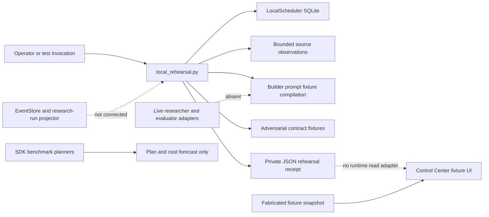

# Architecture review: 2026-09-07

Status: engineering assessment of an uncommitted integration candidate

Later bounded update: the [portable harness](portable-harness.md) now connects
verified captured campaigns to frozen data-policy comparisons and inert
proposals. [Measured results](portable-harness-results.md) and the
[paper protocol](portable-harness-paper-protocol.md) distinguish this from
unimplemented autonomous scientific evaluation and production promotion.

Follow-up implementation: [captured observation pipeline](research-observation-pipeline.md) now connects bounded sources, immutable response capture, explicit corpus context, verified handoffs and a separate real local observation UI. The review below remains the earlier assessment, not a rewritten historical test receipt. Current implementation status is recorded separately in [architecture-status.json](architecture-status.json).

This review assesses the working tree rooted at branch `codex/local-production-rehearsal`, whose Git HEAD is `c6cd52017b247804373339e1c3c103d42554b0a1`. HEAD identifies its ancestor, not the changed code reviewed here. The final integration receipt must bind the tested candidate bytes. This document and [architecture-status.json](architecture-status.json) are status reports, not authorization, accepted specifications, or deployment attestations. The [August 25 PR audit](pr-audit-2026-08-25.md) remains a historical observation; it cannot establish September PR state.

## Executive assessment

The repository has a substantial research corpus, unusually explicit authority and evidence contracts, deterministic validators, a durable event-store prototype, a bounded scheduler, source-observation adapters, a prompt compiler, and a usable interface prototype. These parts do not yet form an operating research organization. The local rehearsal ends at source observations, prompt artifacts, and contract checks. It does not execute a researcher model, generate a research report, independently evaluate an authored candidate, or feed real status into the UI.

The highest-value next work is one integrated source-to-report experiment with reproducible evidence and independent evaluation. More role names, cloud services, prompt prose, or simultaneous agents will not close that gap. Success should mean more verified, useful mechanisms per unit of cost and maintainer attention, measured against a strong single-agent baseline. There is currently no comparative evidence supporting a claim of world-leading performance.

The proposed production topology is much larger than the current operational need. Preserve its trust boundaries, but keep the supervised local control plane to one supervisor, one transactional database, immutable artifacts, and a read-only projection adapter until measurements justify distribution. Untrusted code execution still needs the separately accepted isolation boundary described in SPEC-014; simplifying the control plane must not turn the maintainer host into a candidate-code sandbox.

## What actually executes

The graph below describes current code connections, not the roadmap. Dashed edges indicate missing product integration.

The relevant connection evidence is explicit in code:

- `researcher/scripts/local_rehearsal.py` imports the scheduler, connectors, prompt compiler, and adversarial runner. Its dispatcher has three handlers: discovery, contract checks, and prompt compilation. It imports neither the event store nor the research-run projector.
- `researcher/scripts/prompt_compiler.py` has no provider, process-launch, model, credential-resolution, or tool-execution interface. `compile_prompt` returns a private prompt instance and separately identified safe projection.
- `researcher/benchmarks/sdk-runner/src/runRouter.ts:43` and `runEffectiveness.ts:46` reject non-dry execution. The injected `RouterExecutor` in `routerEngine.ts` is a test seam, not a configured provider.
- `apps/control-center/lib/fixture-adapter.ts:10` imports `controlCenterFixture`; `fixtures.ts:6` supplies the snapshot. Its apparent health, runs, queue, and current freshness are fabricated fixture data.
- `researcher/event_journal/README.md` explicitly says the journal is not authoritative for `run-state.json`; shadow mirroring and cutover remain future work.

The local rehearsal is useful for validating composition and failure handling. Its successful execution must not count as an autonomous research result or an effectiveness benchmark. A fixture test can establish a contract property; it cannot establish that a model follows the prompt or that a paper's claim is correct.

## Agents: responsibilities versus running processes

SPEC-013 proposes twelve role families. That is an inventory of responsibilities, not a requirement for twelve persistent agents or twelve calls per source. No accepted runtime role manifests currently connect those families to dispatch. The prompt compiler supports `builder` and `verifier`, with supplied role, attempt, context, and digest bindings. Its distinct identifiers provide structural checks; they do not independently prove separate authenticated principals, workspace isolation, or absence of shared evaluator context. The repaired rehearsal compiles builder fixtures only and has removed its synthetic verifier-independence claim and caller-invented candidate/authority digests.

The smallest useful product should use these responsibilities:

| Responsibility | First implementation | Input and output | Independence and authority |
| --- | --- | --- | --- |
| Coordinator | Deterministic supervisor, no model | Query, policy, budget, due work to reservations and status | Sole local work acceptance path; no scientific judgment |
| Source discovery | Deterministic connector handlers | Versioned query to lead pages and retrieval outcomes | Public observation only; no candidate promotion |
| Research curator | One bounded model attempt | Captured evidence and corpus map to claims, mechanisms, contradictions, and a candidate report | May propose; cannot change evaluator or accepted corpus |
| Evidence critic | Separate bounded attempt when a candidate reaches the evidence gate | Frozen report, source evidence, rubric to independently supported defects and disposition | No builder transcript or peer verdicts in first pass; distinct execution context |
| Experiment executor | Deterministic runner, model use only where the task requires it | Frozen candidate and sealed task set to raw observations | Evaluator environment owns the grader; candidate cannot rewrite it |
| Report assembler | Deterministic renderer | Accepted observations and unresolved contradictions to versioned report and diff | Every assertion retains evidence status; no invented success |
| Maintainer | Human decision | Review packet to acceptance, rejection, or scoped follow-up | Public merge and deployment decisions remain separate |

Additional reviewers should be conditional. Escalate when sources conflict, evidence is incomplete, or calibrated reviewer disagreement predicts a consequential error. Measure the incremental error reduction and cost of a second reviewer. Do not permanently allocate a model process to each title.

Prompt construction should bind the objective, source/corpus snapshot, output schema, evaluation criteria, limits, and selected skill versions. Raw web text belongs in evidence slots. Hidden evaluation material and provider credentials remain outside author contexts. Prompt wording can explain those boundaries; the dispatcher, filesystem, and tool interfaces must enforce them.

## Component and state ownership

| Surface | Current implementation | Present authority | Missing connection |
| --- | --- | --- | --- |
| Public corpus and registries | Skill files, mechanism/claim indexes, inventory and validators | Git-reviewed corpus; local working edits remain proposals | Atomic candidate construction and evaluated promotion across every changed surface |
| Legacy supervised workflow | `research_loop.py`, queue JSONL, `run-state.json` | Supervised migration workflow only | Explicit migration/shadow plan before another store replaces its state |
| Event journal | SQLite WAL, subject versions, idempotency, hash chain, backup/restore, projector | Standalone implementation prototype | Work acceptance, source observations, prompts, results, and UI do not use this journal |
| Local scheduler | SQLite schedules, due work, leases, fencing, retry state | Rehearsal-local state only | Registered work contracts and transactional journal/outbox integration |
| Retrieval | Typed bounded public observations with provider adapters | Leads and transport observations only | Immutable raw capture, extraction spans, freshness/licensing decisions, and evidence acceptance |
| Prompt compiler | Deterministic builder/verifier prompt and projection records | No execution authority | Accepted role/profile resolution, context compilation, token packing, executor binding |
| Benchmark runtime | Dry planners and private manifest/claim/result test prototype | No live provider execution | Accepted evaluation observation schema, provider adapter, budget reservation, ambiguity reconciliation |
| Control Center | Next.js fixture views and finite JSON APIs | Read-only fabricated UI state | Real projection adapter, authentication, command handling, current runtime freshness |
| Report updates | Historical router renderer and rehearsal receipts | Diagnostic/historical outputs | Research synthesis, claim/contradiction graph, independent verdict, report revision lineage |

The system currently has several writable state formats: legacy queues and run files, journal SQLite, scheduler SQLite, SDK-private run files, and rehearsal JSON artifacts. This is acceptable while experiments remain isolated. It becomes an operational correctness problem if more than one can decide whether the same attempt is complete, reserved, accepted, or promoted.

The consolidation target is one local transaction boundary for canonical work, journal acceptance, reservations, and outbox intent. Projections are disposable. Artifacts are immutable and content-addressed. SDK files should become adapter-private receipts referenced by canonical observations; they must not silently become a competing organization database. Migration requires shadow parity and a declared cutover, not dual writes that can independently succeed.

The event store is a strong foundation: its code provides bounded append checks, full read/audit verification, subject-version conflict handling, transactionally consistent chain updates, and receipt-bound restore generations. Its hash chain is tamper-evident, not authenticated against an operator who can rewrite all state. That limitation is documented correctly. Acceptance and external anchoring are separate concerns.

## Findings and disposition

| ID | Severity | Finding and evidence | Disposition |
| --- | --- | --- | --- |
| ARCH-001 | Product blocker | No model-driven source-to-report-to-independent-evaluation path. Rehearsal dispatch ends at compiled prompts and contract fixtures. | Open; implement the first scientific vertical slice before claiming autonomy. |
| ARCH-002 | Product blocker | The journal, scheduler, legacy run state, and SDK-private state are disconnected. UI reads fixtures. | Open; select one acceptance transaction and derive observable state from it. |
| ARCH-003 | Evaluation defect | The sole effectiveness verifier accepted `API_RATE_LIMIT=84750` when the expected value was `8475`, because `verify.sh:16` used substring matching. A disposable probe exited 0 with only that wrong answer. | Fixed during this review by the integration owner; the same independent probe now exits 12. Exact assignment and contradictory-value tests added. Recheck the final candidate receipt for suite results. |
| ARCH-004 | Evaluation defect | The renderer resampled individual calls. Duplicating two fully correlated prompts narrowed the interval from `[0,1]` to `[0.35,0.65]` without adding independent tasks. | Fixed for future reports: prompt-cluster resampling, paired baseline differences, stable grouping, missingness bounds, and no interval below two usable prompts. Published reports are unchanged; representative task-family design remains required. |
| ARCH-005 | Product blocker | Builder/verifier compiler identifiers are supplied inputs; no authenticated reservation, context firewall, live execution, or independent result is produced. SPEC-013 itself says two prompt roles in one session are not independence. | Open; bind manifests to separate reservations, allowed artifacts, and isolated attempts. |
| ARCH-006 | Capability gap | Retrieval observations are not accepted immutable evidence. No product path turns source spans into graded claims, counterevidence, or benchmarkable mechanisms. | Open; add capture and evidence contracts before scientific conclusions. Connector fixes and live outcomes belong to the retrieval review receipt. |
| ARCH-007 | Deployment blocker | The checked-in launchd entry points are inert. No accepted supervisor deployment, live command API, active epoch, or integrated recovery drill exists. | Open; the scheduled 72-hour observation plan is a bounded engineering experiment, not production deployment. |
| ARCH-008 | Status defect | Product README still described an enabled opt-in legacy fetch/launchd path and called current router evaluation available. | Fixed in this review: legacy boundary and zero-call router status now match integrated code. |
| ARCH-009 | Evidence limitation | Activation smoke checking is token overlap and tests expected inclusion in the top three (`check_activation_cases.py:81-103`). Passing that gate is neither live top-1 routing nor skill effectiveness. | Keep as a cheap smoke gate, label it precisely, and measure actual model behavior separately. |
| ARCH-010 | Deployment constraint | Hosted-agent example has provider-specific execution, file, and snapshot hooks (`sandbox_manager.py:767-840`); no configured, attested provider connects it to the research dispatcher. | Treat as educational/preparatory code. Provider conformance and isolation are required before candidate code execution. |
| ARCH-011 | Runtime defects | Unknown SQLite identities could be overwritten; expired leases could complete; exhausted work could remain stuck; cached reports could bypass source/artifact checks. | Fixed: schema identity checks, lease/fence validation, explicit retry exhaustion, serial dependencies, per-run locking, byte-bound artifacts and crash-safe replay. |
| ARCH-012 | Retrieval defects | Official arXiv links failed validation, failed requests lost accounting, and capped feed pages could silently skip entries. | Fixed and tested across transport deadlines, failure receipts, arXiv parsing, GitHub pagination and query-bound RSS/Atom resume. Mutable feed changes fail explicitly; raw-evidence capture is still absent. |
| ARCH-013 | Evaluation defect | Empty or partial adversarial catalogs could pass without complete execution. | Fixed: missing/duplicate/unknown entries fail, duplicate JSON keys are rejected, and execution counts exclude missing runners. Semantic classifier quality remains unmeasured. |
| ARCH-014 | Dependency risk | The SDK runner's ConnectRPC dependency retained an affected Undici line. | A scoped exact override removes current audit findings while preserving the SDK pin and zero-call boundary. This cross-major bridge needs upstream removal and live compatibility evidence before provider activation. |

The repeated theme is evidence scope, not lack of code. Repository correctness, contract checks, source availability, scientific quality, model compliance, user comprehension, and production recovery are different measurements. A green value in one must never be substituted for another.

## September pull-request refresh

The September 7 read-only GitHub refresh returned 35 open PRs. All 35 retained the exact heads, bases, and draft states recorded in the [August audit](pr-audit-2026-08-25.md), so its code dispositions remain applicable to those unchanged diffs. PR #94 was absent; a direct lookup could not resolve it. This is not evidence that it was merged or closed. No new PR diff was inferred from that absence.

PRs #121 through #131 still have successful historical `validate` results against their proposal bases; #122 through #131 remain drafts. #132 retains a failing validation result. Other open PRs have no recorded check runs in this query. These results do not cover this uncommitted integration candidate or establish that retargeted PRs will pass.

The queried protected default remains `6dbe1a1d868eab51a3bc9011b0f55e2891513e40`. The observed active ruleset still has no required status-check rule and permits an always-bypass repository administrator role. No GitHub settings, approvals, PRs, or branches were changed. Raw observations are retained privately with the integration verification receipts; any human merge decision requires another current exact-head and rules check.

## Smallest end-to-end research loop

The first integrated loop should address one bounded research question and one report revision, with no automatic public mutation:

1. Record the question, competing hypotheses, known corpus baseline, allowed sources, novelty criterion, success metric, and total budget.
2. Retrieve a bounded primary-source set. Persist exact bytes, request/response metadata that is safe to retain, retrieval status, content digest, extraction version, and evidence spans. Leads and excerpts alone cannot justify a full-paper conclusion.
3. Run one curator attempt over the evidence and relevant existing mechanisms. Require typed claims with evidence strength, contradictions, limitations, mechanism proposal, and an experiment that could falsify the proposal.
4. Freeze the report candidate and editable surface. Run an independent critic against the source evidence, without builder reasoning. Preserve disagreements; adjudication must cite the conflicting observations.
5. Select at most one feasible mechanism for a controlled baseline-versus-candidate experiment. Pin tasks, models, environments, prompts, stopping rule, budgets, and grading code before candidate execution.
6. Analyze paired task-level outcomes, failures, latency, tokens, and cost. Keep inconclusive and negative results. A literature claim is a reported result until locally reproduced; a positive local experiment remains scoped to its tasks and conditions.
7. Render a report revision containing evidence, rejected alternatives, experiment artifacts, uncertainty, and the recommended next step. Show it in the local UI with an explicit review status and immutable links.
8. A human may accept a report or authorize a repository proposal. Public corpus updates must include the skill body, mechanisms, claims, activation fixtures, generated inventory, and verification evidence. Deployment is a separate decision.

A report must be able to say “insufficient evidence” without triggering more model calls indefinitely. Stopping conditions include exhausted budget, unresolved retrieval failure, no novel mechanism, inconclusive experiment, and an independent rejection. These are useful terminal results, not orchestration failures.

## Evaluation design and measurable gates

These are proposed engineering thresholds and experiment designs, not measured achievements. They should be frozen with each experiment and adjusted only before observing score-bearing results.

| Question | Measurement | Initial acceptance rule |
| --- | --- | --- |
| Are reports supportable? | Human-calibrated claim audit: exact source span, support, contradiction treatment, and evidence grade | Every factual claim has a resolvable source or explicit inference label; zero unsupported release-critical claims |
| Are discoveries useful? | Blinded maintainer judgment of actionable, nonduplicate mechanisms against a preregistered corpus baseline | Report precision and yield separately; measure a single-curator baseline before choosing a lift threshold |
| Does a skill improve work? | Paired independent task groups across baseline, candidate, and irrelevant-skill control | Positive practical effect or preregistered non-inferiority on the primary measure; no blocking family-specific regression |
| Does multi-agent review help? | Same sources and budgets, single curator versus curator plus independent critic | Report error reduction per additional dollar and minute; keep extra reviewer only if it improves the selected Pareto trade-off |
| Is evaluation unbiased? | Blinded candidate labels, swapped pairwise order, negative controls, human calibration | No hidden-task leakage; report judge disagreement/order effects and prohibit self-grading |
| Are runs reproducible? | Source, task, model, tool, prompt, environment, candidate and analysis identities | 100% of score-bearing observations resolve all required bindings and raw artifacts |
| Does orchestration recover? | Kill before/after claim, result write, completion acceptance; replay and backup restore | No false completion, no duplicate accepted effect, stale fences rejected, interrupted work remains explainable |
| Are cost and resources bounded? | Reservations, calls including repairs, wall time, output bytes, memory and queue growth | Zero unreserved calls and no configured ceiling exceeded; unknown provider outcomes retain conservative reservations |
| Can an operator understand state? | Five representative tasks: locate failure, inspect evidence, explain spend, pause, recover | All tasks complete from UI/CLI and artifacts without chat history; separately report usability timing and errors |

A count of calls is not sample size. For a new study, define independent task families, the pairing/grouping keys, the effect size worth detecting, and a power or sensitivity rationale. Three model replications help estimate stochastic variability but do not establish statistical power. Bootstrap independent groups, preserve pairing for differences, report both availability and quality, and include missing-result sensitivity. Repeated optimization against the same held-out set turns it into training data; maintain a sealed final evaluation and a correction history.

Stage 3 currently has one task. Correcting its grader does not make it representative. The next fixture tranche should cover context offload, retrieval provenance, contradictory evidence, stale claims, tool failure recovery, and skill composition, with positive and negative controls. Selection should come from observed product failure modes, not from tasks that flatter the existing skills. The exact sample size follows the experiment's sensitivity calculation.

## Long-duration local operation

The current plan is 72 hourly scheduled observations. This review does not claim 72 elapsed hours have run. A compressed loop or synthetic future timestamp cannot satisfy a duration requirement. The scheduled task should persist its start, latest observation, actual wall-clock span, completed/failed/missed cycles, `input_manifest_digest` and its source/configuration bindings, query set, and remaining budget outside chat history. The local manifest is not an accepted candidate freeze receipt.

A useful soak separates two modes:

- **Continuous bounded observation:** public connector health, source yield and duplicates, local scheduling/recovery, deterministic checks after code changes, report freshness, and storage growth. Run public queries across context compilation, long-horizon agents, evaluation integrity, and multi-agent coordination. Keep failed connectors visible.
- **Explicit scientific epochs:** a frozen query/source set, bounded model and experiment budget, independent evaluation, and fixed stopping rule. Run these only through the accepted live adapter and reservation path. Keys alone do not implement that path.

Retain per-cycle receipts and a small rolling summary. A cycle with zero new material can be healthy. A cycle that fetches data but cannot produce immutable evidence must remain an observation, not a completed research result. Track useful-source yield, duplicates, 429s, timeouts, extraction failures, queue age, lease recovery, wall time, bytes, and model cost where models actually ran. Long-run success requires real crash/restore evidence and no unbounded accumulation; repeated green fixture checks alone are insufficient.

## Implementation order and deferred work

| Slice | Deliverable | Exit evidence |
| --- | --- | --- |
| A. Accurate local observation | Safe connectors, bounded schedule/rehearsal, dated status, live failure receipts | Different public queries, explicit disabled paths, restart and deadline tests, real elapsed soak accounting |
| B. One durable work acceptance path | Journal-backed work/result acceptance and rebuildable read projection | Duplicate delivery, stale fence, crash, shadow parity, clean restore and exact projection parity |
| C. Evidence-to-report | Immutable capture, extraction provenance, one curator, independent critic, report renderer | Complete source-to-claim trace, withheld counterevidence test, model/format failures, supported/unsupported claim calibration |
| D. One measured improvement | Correct graders, frozen candidate, sealed paired task groups, budgeted provider adapter and analysis | Baseline/candidate/negative-control artifacts, grouped uncertainty, missingness, cost and rollback evidence |
| E. Local operator product | Live projection API and UI, command boundary, pause/recovery, review packet | Browser tasks against real status; stale/permission/error/reconnect cases; no direct UI state mutation |
| F. Proposal and deployment | Exact candidate review, authorized draft-PR adapter, release lineage and canary | Current GitHub controls, human merge observation, independent activation, restore/rollback/kill drills |

The specification dependency graph and terminal amended foundation revisions remain integration constraints. If its current decomposition requires implementing most of the organization before a supervised report can be tested, propose narrowly scoped replacement or bootstrap contracts with explicit exclusions. Do not silently bypass lifecycle gates, and do not solve a sequencing problem by building every cloud component first.

Defer multi-tenancy, persistent persona memory, automatic social publishing, contact enrichment, adaptive production routing, weight training, a general-purpose agent hosting platform, additional cloud queue products, and warm-pool optimization. Revisit each when a measured bottleneck or validated user requirement pays for it. The proposed GCP topology is a future deployment option; no hosted latency, cost, availability, or isolation result in this review establishes that option as production-ready.

## Current local verification

These are September 7 engineering observations, not scientific quality results or a release attestation. Raw logs, live receipts, browser evidence and input manifests are retained privately. The source tree remains uncommitted.

| Surface | Observed result | What it does not establish |
| --- | --- | --- |
| Full Python suite, CI Python 3.12 family | 826 tests passed in 170.945 seconds | Hosted runtime or model behavior |
| SDK contract suite, Node 22 | 82 tests and type checking passed; dry plans made zero provider calls | Live model quality, provider compatibility or spend execution |
| Cross-runtime schemas | 22 TypeScript tests passed; Python registry/golden/migration gates passed | Accepted operational ownership |
| Operator UI | 27 tests, type checking, production build and standalone smoke passed; nine static assets checked | Authentication or real research-state integration |
| Browser journey | Overview, stale-state navigation and matching status API verified; deployment stayed disabled | An operating control center; verification stops at the missing live adapter |
| Bounded live discovery | Separate context-engineering, memory and coordination queries observed arXiv, GitHub API/Atom and a bounded HN window | Accepted paper evidence or research conclusions; HN found no matches in its scanned window |
| Scheduler stress | 100 cycles, 300 scheduled stages and 100 identical replays; zero network/model calls | Long elapsed uptime or semantic research success |
| Repository/packaging | Strict repository, platform layouts, inventory, governance, lifecycle, export, migration and event-journal gates passed | A clean committed release or deployment approval |
| Evaluation smoke | Seven adversarial mutations passed; activation expected-skill top-three passed 23/23, token-overlap top-one was 20/23 | Live routing or skill effectiveness |
| Supply chain | SDK/UI production dependency audits found zero issues; Gitleaks 8.30.1 found no secrets in the 670-file prospective public input tree | Comprehensive security certification or container-image scanning |

The first full run exposed one Python-version-dependent test assumption. Both interpreters rejected a deeply nested, schema-invalid GitHub response, but at different layers. The corrected test asserts typed rejection with provenance; an injected parser error separately verifies exact error translation. The complete suite above was rerun after that correction. Live retrieval measurements used unchanged connector implementation bytes.

The Git index still contains a file already deleted in the working tree, `researcher/reports/benchmark-history.jsonl`. Public-tree scanning evaluated the prospective existing-file candidate, including untracked additions and excluding that deletion. It is not a claim that the current index or HEAD passes the release scan. No staging or commit was performed to hide that distinction.

Docker CLI is installed but its daemon is unavailable. Container build, image scanning, clean-container behavior, production identity/isolation, and integrated restore/rollback remain unverified. The 72-hour task is scheduled, not completed; sparse observations are not a continuously running service.

## Review scope and remaining uncertainty

This review inspected current code paths, specifications, product docs, historical experiment narratives, benchmark contracts, prompt compilation, event/projection ownership, UI adapters, and hosted-agent extension points. The implementation and verification results above are bounded to this integration candidate. No model calls, infrastructure deployment, GitHub mutation, accepted research promotion, or 72 completed hours are claimed.

The most important unresolved measurements are research quality, independent review benefit, full-body skill effectiveness, end-to-end latency/cost, source freshness and coverage over elapsed time, and recovery of the integrated product. Until these are measured, the defensible status is a strengthened local engineering rehearsal with an incomplete autonomous product.
