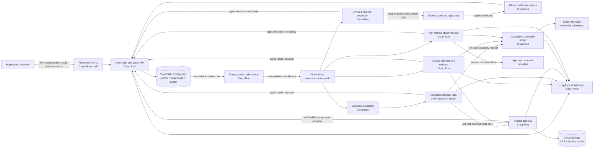

# Deployment and operations blueprint

Status: non-normative architecture proposal

September 8 refinement: the [portable operations design](research-harness-operations.md) recommends a supervised single-tenant Linux node before managed-cloud expansion. The Google Cloud topology below is retained as a later scale-out option, not the initial MVP requirement or provisioned infrastructure.

Earlier proposal: supervised local pilot, then single-organization hosted beta on Google Cloud

Alternative: Vercel for the web surface only, with the control and execution planes remaining on Google Cloud

> This document cannot authorize infrastructure creation, credential use, external traffic, draft-spec implementation, or production activation. It proposes a deployment shape for later human-reviewed specification revisions and deployment manifests. SPEC-025 currently describes a local-first deployment and remains draft. A hosted beta that conflicts with its accepted successor will require an explicit amendment; this document cannot supply one.

## Deployment decision

Use Google Cloud for the hosted beta because the product needs four different runtime properties:

1. request/response services for the UI, command API, GitHub ingress, and trusted deterministic handlers;
2. durable relational transactions for the event journal, projections, command ledger, and transactional outbox;
3. immutable object storage for evidence, candidates, receipts, exports, and backups; and
4. a stronger isolation lane for code or content that is candidate-authored, community-authored, or part of a hidden evaluation.

The recommended split is:

- Cloud Run services for the UI, command/query API, GitHub webhook ingress, separately permissioned artifact gateway, capability broker, external-effect workers, and trusted workers;
- Cloud SQL for PostgreSQL for the journal, projections, outbox, reservations, and operational indexes;
- a separately permissioned outbox relay for leasing committed outbox rows,
  idempotently creating tasks, and reconciling ambiguous enqueue outcomes;
- Cloud Storage for content-addressed artifacts and backup copies;
- Cloud Tasks for explicit asynchronous delivery, retry pacing, and backpressure;
- GKE Autopilot Jobs with `RuntimeClass: gvisor`, resource limits, no ambient cloud authority, and deny-by-default network policy for untrusted attempts;
- Secret Manager plus workload identities for private credential references;
- Artifact Registry for digest-pinned runtime images;
- Cloud Logging, Monitoring, Trace, Error Reporting, and Audit Logs for the operational plane.

### Where each product surface runs

| Surface | Default location | Alternative | Canonical state |
| --- | --- | --- | --- |
| Public skill source and release | Protected GitHub repository, release artifacts, Claude/Open Plugins manifests | Mirrored read-only package registries | Exact human-merged Git tree |
| Public documentation | GitHub Pages or another static site tied to the exact release | Vercel static deployment | Versioned public repository artifacts |
| Private control UI | Cloud Run behind IAP | Vercel UI using OIDC to the Google Cloud API | None; projection client only |
| Command/query and GitHub ingress | Separately permissioned Cloud Run services | None for the beta | Accepted events and projections in Cloud SQL |
| Outbox delivery and GitHub effects | Separate Cloud Run relay and effect worker identities | In-process adapters during the supervised pilot | Journaled outbox operation and reconciled provider receipt |
| Trusted deterministic agents | Cloud Run services or Jobs | Local bounded process during the pilot | Typed result artifacts; workers own no canonical state |
| Candidate, community, and hidden-evaluation agents | GKE Autopilot Jobs with gVisor in a separate sandbox project | A later SPEC-014-conformant ephemeral provider | Typed results and broker-accepted artifacts only |
| Journal, projections, and outbox | Cloud SQL for PostgreSQL | SQLite WAL for the supervised local pilot | Journal is canonical for accepted operational events; projections rebuild |
| Evidence and candidate bodies | Cloud Storage CAS | Local CAS for the pilot | Exact bytes plus private storage bindings |
| Secrets and external authority | Secret Manager plus workload identities and broker | Keychain/local secret-store provider for the pilot | Secret provider; prompts and artifacts contain references only |
| Human results | Private UI inbox and linked review packets | Approved email/chat notification with a private link | Result envelope and artifact references |
| Public candidate results | Draft GitHub pull request and checks | None | Human-merged Git tree after review |

Cloud Run supports services, run-to-completion jobs, and worker pools, but its writable filesystem is disposable, so no canonical state may live inside a container instance ([Cloud Run overview](https://docs.cloud.google.com/run/docs/overview/what-is-cloud-run)). Cloud Tasks is deliberately treated as an at-least-once dispatch system; task handlers must remain idempotent and canonical completion must be reducer-accepted in the journal ([Cloud Tasks overview](https://docs.cloud.google.com/tasks/docs/dual-overview)).

Ordinary Cloud Run Jobs are suitable for trusted bounded batch work, but they are not the sole security boundary for untrusted code. GKE Sandbox adds a gVisor userspace kernel for unknown or untrusted workloads, and Google recommends explicit resource limits plus blocking metadata access ([GKE Sandbox](https://docs.cloud.google.com/kubernetes-engine/docs/concepts/sandbox-pods)). FQDN network policies can create an implicit deny for destinations not on an egress allowlist ([GKE FQDN network policies](https://docs.cloud.google.com/kubernetes-engine/docs/how-to/fqdn-network-policies)). Cloud Run's nested code-execution sandbox is currently Preview, so it remains an experiment rather than the beta's production isolation control ([Cloud Run code execution](https://docs.cloud.google.com/run/docs/code-execution)).

## Deployment topology



### Project and account boundary

Use separate Google Cloud projects for development, staging, production control, and production sandbox execution. The sandbox project has no direct route or IAM grant to the production database, bucket, secrets, or GitHub installation. Narrow, separately deployed artifact and capability APIs are its only data boundaries; external effects are performed by distinct operation workers. None of those services owns canonical journal writes.

Recommended projects:

| Project | Responsibility | Human access |
| --- | --- | --- |
| `agent-org-dev` | Synthetic integration, infrastructure tests, disposable adapters | Maintainer and developers |
| `agent-org-staging` | Production-shaped shadow data, restore and canary drills | Maintainer and operators |
| `agent-org-prod-control` | UI/API, journal, projections, outbox, CAS, secret broker, GitHub integration | Maintainer; audited operator roles |
| `agent-org-prod-sandbox` | GKE Autopilot cluster and untrusted attempt jobs | Deployment identity; break-glass human only |
| `agent-org-backup` | Encrypted backup copies and recovery manifests | Separate recovery identity |

Development, staging, production, sandbox, and backup identities are non-interchangeable. Google recommends separate projects for environments and least-privilege Secret Manager access ([Secret Manager best practices](https://docs.cloud.google.com/secret-manager/docs/best-practices)). Each application receives a dedicated service account; service-account keys are avoided in favor of attached workload identity or federation ([service-account security](https://docs.cloud.google.com/iam/docs/best-practices-service-accounts)).

## Component contracts

### `control-ui`

- Private web application behind Identity-Aware Proxy.
- Reads versioned projection/query endpoints only.
- Sends commands with actor session, exact target, expected version, reason, idempotency key, and confirmation metadata.
- Holds no database credential, GitHub App private key, model credential, or merge capability.
- Polls projection endpoints every 5 to 15 seconds in MVP. Server-sent events can be added after correctness and reconnect behavior are measured.

The repository contains a Next.js implementation under [`apps/control-center`](../../apps/control-center) with a real, read-only loopback observation adapter and separate fixture controls. The observation view reads verified local run summaries; it does not issue authoritative commands. Hosted deployment remains disabled until authentication, the accepted command boundary, and owning specifications are operational.

IAP can protect a Cloud Run service directly without requiring a load balancer; the application must still verify and bind the authenticated identity to its own actor model ([IAP for Cloud Run](https://docs.cloud.google.com/iap/docs/enabling-cloud-run)).

### `control-api`

- Private Cloud Run service with no public unauthenticated ingress.
- Owns command parsing, policy evaluation, expected-version checks, query endpoints, and human confirmation records.
- Writes commands/events and the matching outbox record in one database transaction.
- Never performs a slow external effect inside the user request.
- Returns `202 Accepted` plus command identity and projection cursor for asynchronous operations.

### `github-ingress`

- Minimal public Cloud Run endpoint for GitHub webhooks only.
- Verifies the signature over the original request bytes before JSON parsing.
- Records delivery identity and raw-body digest, then acknowledges promptly.
- Has no GitHub write credential and no direct runtime dispatch power.
- Polling reconciliation remains enabled so a lost webhook cannot become a lost organizational fact.

GitHub Apps start with no permissions and should request only the permissions required by their API calls and webhook subscriptions ([GitHub App permissions](https://docs.github.com/en/apps/creating-github-apps/registering-a-github-app/choosing-permissions-for-a-github-app?apiVersion=2022-11-28)). Use separate observer, proposer/check-reporter, and reconciler identities when their operation sets differ. None receives merge, ruleset, administration, or production-activation authority.

### `event-store`

- Regional Cloud SQL for PostgreSQL instance.
- Append-only journal tables, subject versions, immutable command/decision records, projections, reservations, and transactional outbox.
- One writer API owns event acceptance. Workers never receive direct SQL credentials.
- Projection tables are disposable and rebuildable; journal bytes and accepted artifact bindings are not.
- Connection pooling is bounded at the event-acceptance API. Database concurrency never becomes implicit work concurrency.

Cloud SQL can restore from backups or point-in-time recovery; the product still needs its own generation, chain-continuation, projection-replay, and external-reconciliation semantics before a restored database can become active ([Cloud SQL restore](https://docs.cloud.google.com/sql/docs/postgres/backup-recovery/restore)). Provider restore is necessary but does not prove application-level recovery.

### `dispatch-queues`

Use one Cloud Tasks queue per materially different work class, for example `trusted-validation`, `retrieval`, `sandbox-attempt`, `evaluation`, `github-effect`, and `notification`. Each queue has explicit rate, concurrency, retry, and application-owned retry-exhaustion escalation policy.

A task payload contains only:

- work-order and attempt identity;
- expected fence and descriptor digest;
- handler kind/version;
- an opaque lookup reference; and
- the Cloud Tasks delivery identity needed for diagnostics.

It contains no prompt, evidence body, secret, provider locator, reusable capability, or canonical transition. Cloud Tasks may redeliver; handler success means only that the handler returned a successful response. The reducer decides whether a result applies.

### `outbox-relay`

- Reads only committed outbox rows through a leased, fenced claim operation.
- Builds a deterministic Cloud Tasks name from the outbox operation identity;
  an already-existing task is treated as the same delivery, not a second effect.
- Records the task name and delivery state through the event-acceptance API.
- If create-task returns an ambiguous transport outcome, looks up the exact task
  identity before retrying and otherwise leaves the row in
  `reconciliation_required`.
- Does not mark the underlying work complete. It only reconciles dispatch.
- Uses bounded claim age, retry, and dead-letter escalation; expired claims are
  recoverable without minting a new operation identity.

Cloud SQL does not enqueue Cloud Tasks by itself. The relay is the explicit
bridge between the transactional database outbox and the at-least-once delivery
service. Its crash tests cover before/after claim, create request, ambiguous
response, task lookup, and receipt commit.

### `github-effect-worker`

- Owns the narrowly scoped proposer/check-reporter or reconciliation credential;
  the public webhook ingress owns none.
- Accepts only registered GitHub operation kinds with exact repository, head,
  expected version, idempotency identity, and capability grant.
- Never merges, approves, edits rules, changes repository administration, or
  activates a deployment.
- Returns a typed provider receipt or `reconciliation_required` result to the
  event-acceptance API; it never writes the journal directly.
- Reconciles by provider identity before any retry after an ambiguous outcome.

### `trusted-workers`

- Cloud Run services or Jobs for deterministic validators, inventory/schema builds, projection rebuild, source parsing that executes no source code, and bounded administrative checks.
- Digest-pinned image and dependency closure.
- Dedicated workload identity per work kind.
- No writable canonical local state.
- Explicit CPU, memory, timeout, concurrency, and output limits.

Cloud Run Job tasks can run longer than request services and have explicit timeout/retry controls, but retries still require idempotent application behavior ([Cloud Run task timeout](https://docs.cloud.google.com/run/docs/configuring/task-timeout)).

### `sandbox-dispatcher` and `sandbox-attempt`

The dispatcher creates one Kubernetes Job per attempt in the sandbox project. The Job specification binds:

- exact image digest, source/candidate digest, role, work order, attempt, fence, and context-package digest;
- `RuntimeClass: gvisor`;
- non-root user, read-only root filesystem, seccomp default, dropped Linux capabilities, no privilege escalation, and no host namespace or host path;
- CPU, memory, ephemeral-storage, process-count, wall-time, output-byte, and network budgets;
- `automountServiceAccountToken: false` unless a reviewed workload identity is strictly necessary;
- one writable ephemeral workspace and explicit read-only input mounts;
- deny-by-default Kubernetes `NetworkPolicy`, metadata denial, and narrow FQDN/port egress where a work kind requires network;
- no Secret Manager mount and no reusable provider credential;
- result upload through an attempt/fence-bound broker call.

The sandbox is destroyed after result reconciliation. Its filesystem is not a checkpoint. Checkpoints are typed immutable artifacts accepted through SPEC-005.

### `artifact-gateway`

- Resolves private storage bindings only after authenticating workload identity and validating the operation grant.
- Supports byte-range retrieval and content-addressed upload; validates digest and classification before acceptance.
- Returns only a proposed `ArtifactRef`; the event-acceptance API is the sole component that may bind it into canonical state.
- Has no SQL credential, provider credential, or external-effect authority.
- Never logs secret length, prefix, suffix, raw provider response, hidden fixture, or private locator.

### `external-effect-workers`

- One narrowly permissioned deployment identity exists per operation family; GitHub effects remain isolated in `github-effect-worker`.
- Receives an already accepted operation identity from Cloud Tasks and resolves only the capability needed for that operation.
- Records no canonical state directly and has no SQL credential.
- Returns `possible_effect`, exact provider receipt, or `reconciliation_required` to the event-acceptance API.
- Reconciles provider state by deterministic operation identity before retrying an ambiguous response.

### `artifact-store`

- Cloud Storage bucket namespace for content-addressed bodies, candidate archives, evaluation observations, review packets, public projections, and backup exports.
- Separate buckets and keys by environment and classification.
- Object generation, checksum, classification, retention class, and storage binding are verified on every read.
- Soft delete and/or versioning protect operational mistakes; retention lock is considered only after deletion/correction requirements are settled.
- A second-project backup copy protects against project- or operator-scope failure.

Cloud Storage durability does not remove the need for application checksums, manifests, retention policy, or restore drills ([Cloud Storage availability and durability](https://docs.cloud.google.com/storage/docs/availability-durability)). Google recommends soft delete rather than relying only on Object Versioning for protection from permanent deletion ([Object Versioning](https://docs.cloud.google.com/storage/docs/object-versioning)).

### `credential-broker`

- Secret Manager stores provider secrets; journal artifacts store opaque references and ownership metadata.
- The broker is a separately deployed identity from the artifact gateway and every effect worker. It does not transfer artifacts, call external providers, or write SQL.
- It resolves only one-use, attempt-, fence-, audience-, operation-, resource-, classification-, budget-, and expiry-bound capabilities after application authorization.
- Dedicated service accounts have only the exact secret versions and APIs needed by one component.
- Rotation is versioned and can coexist with already-fenced attempts only through explicit compatibility rules.
- GitHub Actions deploys through Workload Identity Federation, with repository, branch/environment, and workflow claim conditions. No JSON service-account key is stored in GitHub.
- Vercel, if used for the UI, exchanges a Vercel OIDC token for short-lived Google credentials rather than storing a long-lived cloud key ([Vercel OIDC federation](https://vercel.com/docs/oidc)).

### `observability-plane`

Structured logs, metrics, traces, and audit records share these correlation fields where applicable:

```text
organization_id
deployment_epoch_id
work_order_id
attempt_id
fence
event_id
command_id
operation_key
artifact_id
candidate_id
evaluation_epoch_id
github_delivery_id
trace_id
```

Prompts, model outputs, source bodies, secret material, private locators, and hidden fixtures do not enter general logs. Their authorized artifacts are referenced by ID. High-cardinality IDs are trace/log fields, not unbounded metric labels.

## Data and control flow

### Human command

```text
IAP identity
  -> UI command preview
  -> exact deterministic command intent
  -> authentication + policy + expected-version decision
  -> event + transactional outbox
  -> Cloud Tasks delivery
  -> idempotent handler
  -> result/event proposal
  -> reducer acceptance
  -> refreshed projection
  -> UI and optional notification
```

The response path is asynchronous. A successful HTTP response means command receipt, not task success.

### Agent attempt

```text
ready work-order projection
  -> budget reservation
  -> fenced attempt descriptor
  -> environment selection by trust profile
  -> Cloud Tasks dispatch
  -> trusted Cloud Run worker OR gVisor GKE Job
  -> broker-mediated artifact/tool operations
  -> typed result + receipts
  -> reducer validation and application
  -> checkpoint, retry, reconciliation, or terminal result
```

The model cannot choose its environment, widen its context, resolve credentials, alter budget, or apply its own result.

### Candidate and public result

```text
immutable source evidence
  -> evidence graph
  -> context package
  -> builder candidate
  -> candidate freeze receipt
  -> sealed evaluation epoch
  -> independent observations
  -> exact-head release attestation
  -> proposer GitHub App mutation
  -> human merge
  -> promotion record
  -> separate deployment request and canary
```

The public pull request contains the safe review packet and repository change. Raw restricted evidence, private attempt manifests, hidden evaluations, provider billing records, and credentials remain private.

### External-effect reconciliation

Before any non-idempotent external call, record a possible-effect identity and operation key. If the network outcome is ambiguous, the attempt stops in `reconciliation_required`. A reconciler queries the provider by operation key or provider receipt. Only confirmed absence permits a new fenced attempt. Operator UI must never collapse `unknown` into `failed` or offer a blind retry.

## Security and authority model

### Authority is an intersection

For every operation, the effective permission set is the intersection of:

```text
constitution
∩ authenticated actor role
∩ accepted work-order authorization
∩ deployment epoch and mode
∩ data-classification ceiling
∩ environment policy
∩ broker grant
∩ editable surface
∩ remaining budget
∩ expected state version
```

A model, prompt, UI role, provider token, or cloud IAM role cannot enlarge that set. Both application authorization and cloud IAM must permit the operation.

### Human-only operations

The following remain human-only even after production activation:

- merge or enable auto-merge;
- change branch protection or constitutional/evaluation protected surfaces;
- activate a deployment or widen its mode, source, destination, budget, or capability set;
- approve a private/public classification downgrade;
- resolve an ambiguous high-risk effect when evidence cannot determine the outcome;
- administer credentials, authorize disaster-prefix recovery, or invoke break glass;
- authorize training, dataset export, provider training jobs, or model-weight routing.

### Identity separation

At minimum, keep these principals non-combinable:

- human maintainer;
- UI session principal;
- control API;
- GitHub observer;
- GitHub proposer/check reporter;
- GitHub reconciler;
- scheduler/dispatcher;
- artifact gateway;
- capability/credential broker;
- external effect worker per operation family;
- trusted validator;
- retrieval worker;
- candidate builder;
- independent evaluator;
- release attestor;
- canary-health attestor;
- notification dispatcher;
- credential administrator;
- backup/recovery operator.

The proposer App has no merge or repository-administration permission. GitHub installation access follows the App's configured permissions, so the safe boundary must be enforced at registration, not merely in prompt instructions ([GitHub Apps](https://docs.github.com/en/apps/creating-github-apps/about-creating-github-apps/about-creating-github-apps)).

### Data classification

| Class | Examples | Storage and delivery rule |
| --- | --- | --- |
| Public | Merged skills, public claims, safe benchmark reports, release notes | GitHub and public bucket only after registered projection |
| Internal | Work status, ordinary traces, budgets, operational config | Private project; invited operators only |
| Restricted | Licensed source bodies, private feedback, candidate internals, provider receipts | Restricted bucket and broker-mediated access; never general logs |
| Secret | API keys, GitHub App keys, recovery keys, live capability tokens | Secret Manager or dedicated KMS path only; never artifact/event/context/UI body |
| Hidden evaluation | Held-out fixtures, membership, judge calibration material | Separate evaluator identity/storage; builder and proposer denied |

Classification is a high-water mark. Derived data cannot silently downgrade it. Public projection creates a new identity and must pass allowlisted transformation plus secret/privacy scans.

## UI deployment and interaction

The default UI is built as a responsive web application served by Cloud Run behind IAP. The first release can colocate static assets and the query layer, but command handling remains a separately permissioned API. The application uses route-level error boundaries and renders stale/degraded states from the server rather than inventing local success.

Mutation pattern:

1. `GET` a projection containing `version` and `source_sequence`.
2. Build a command preview locally.
3. `POST` the exact intent with `expected_version` and `idempotency_key`.
4. Receive a durable command identity or typed conflict.
5. Follow projection state until terminal or human-blocked.
6. If the projection is stale, show age and disable unsafe actions.

The UI never offers a generic remote shell. The command palette enumerates registered verbs and explains the exact target and effect. Natural language can search and explain state; it cannot be the sole parser for privileged commands.

## Local pilot

The local pilot should prove product behavior before committing to hosted operational complexity:

- dedicated macOS user and runtime root outside the public checkout;
- FileVault and a local secret-store/Keychain provider;
- SQLite WAL journal, local CAS, local projections, and encrypted external backup;
- one launchd-supervised `orgd` process with bounded child processes;
- loopback-only UI/API and authenticated local `orgctl`;
- GitHub polling before any inbound webhook tunnel;
- trusted deterministic execution only, or remote GKE sandbox execution for untrusted work;
- explicit daily spend ceiling, sleep/catch-up policy, and manual availability expectation.

Do not call the local pilot continuously available. Laptop sleep, network loss, user logout, disk pressure, and OS updates are expected failure modes. The pilot exits only after restart, sleep, network-loss, corrupt-state, clean-directory restore, failed-upgrade rollback, and emergency-stop drills pass.

## Hosted beta rollout

### Infrastructure and build

- Terraform or an equivalent reviewable declarative plan owns cloud projects, IAM, network, database, bucket, queues, GKE, services, alert policy, and retention.
- GitHub Actions uses OIDC/Workload Identity Federation and a dedicated deployment service account. Google recommends dedicated service accounts and federation for deployment pipelines ([deployment-pipeline identities](https://docs.cloud.google.com/iam/docs/best-practices-for-using-service-accounts-in-deployment-pipelines)).
- Build once, generate SBOM and provenance, scan, sign, and publish an immutable image digest to Artifact Registry.
- A `DeploymentManifest` binds Git commit/tree, image digests, schema/event-family registries, migration plan, environment policy, feature flags, data ceilings, operation grants, budgets, and rollback compatibility.
- A merge makes a candidate deployable; it does not deploy it.

### Promotion ladder

1. Deploy to development with synthetic data and fake providers.
2. Restore a staging snapshot through the approved private-data procedure.
3. Run schema compatibility, replay, migration, security, contract, load, and cost tests.
4. Start staging in `observe`; compare projections and external reconciler state.
5. Advance to `shadow`; route effects only to shadow sinks.
6. Create a bounded `proposal` canary with one work class, concurrency one, explicit spend, and independent health attestation.
7. The human activates the exact manifest after the canary closes successfully.
8. Increase concurrency and source/work-kind coverage one dimension at a time.

No phase silently changes mode. `start`, `restart`, and `resume` reconstruct an already active epoch; they cannot mint or widen one.

### UI/API rollout and rollback

Cloud Run creates immutable revisions and supports traffic migration between them. Start at zero traffic, run authenticated probes, send a small canary percentage, and increase only while error, latency, policy-denial, and projection-parity gates remain healthy. Rollback routes traffic to a prior compatible revision ([Cloud Run rollouts and rollback](https://docs.cloud.google.com/run/docs/rollouts-rollbacks-traffic-migration)).

Application rollback never rewinds the journal. If a new version has accepted events, restore a compatible binary and replay all surviving events. Projection schema changes use expand/contract or build-new-and-swap. A database backup is not used to erase accepted post-backup state.

### GKE attempt rollout

- Pin the cluster version and gVisor-compatible runtime class.
- Admit only signed images and approved Job manifests.
- Start with concurrency one and no outbound network.
- Test metadata denial, filesystem/mount boundaries, output quotas, timeout, SIGTERM, OOM, process exhaustion, and escape fixtures.
- Add one destination at a time to FQDN/network policy and broker operation grants.
- Quarantine the work kind and revoke new grants on any isolation or policy anomaly.

## Backup, restore, and disaster recovery

### Backup sets

| Data | Primary protection | Independent copy | Restore rule |
| --- | --- | --- | --- |
| Git/public release | Protected GitHub repository and release artifacts | Offline mirror/bundle | Verify exact commit/tree and signatures |
| Journal | Cloud SQL automated backup and PITR | Encrypted logical/physical export plus generation manifest in backup project | Restore to new instance; verify chain continuation and replay |
| Projections | Rebuildable from journal | Optional snapshot for speed | Never trusted until replay digest matches |
| CAS | Checksummed Cloud Storage objects with soft delete/version protection | Cross-project copy with inventory manifest | Rehash every restored object and close reference set |
| Configuration | Git plus private deployment manifest | Encrypted backup copy | Validate schema, signature, environment, and secret references |
| Secrets | Secret Manager versions | Provider-approved recovery mechanism; recovery keys stored separately | Restore references and rotate; do not export values into general backup artifacts |
| GitHub state | Reconciled external source | Journaled delivery/mutation receipts | Poll and reconcile before retrying effects |

### Recovery objectives

These are beta targets, not measurements:

| Data/service | Target RPO | Target RTO | Current measurement |
| --- | ---: | ---: | --- |
| Accepted journal | 5 minutes | 60 minutes | Not measured |
| Acknowledged CAS artifact | 0 within the primary storage service; 24 hours to independent copy | 60 minutes for critical closure | Not measured |
| Rebuildable projections | 0 accepted events | 30 minutes | Not measured |
| UI/query service | No canonical state | 15 minutes | Not measured |
| GitHub/public release | 0 merged commits | 60 minutes to verify and restore mirror | Not measured |

An RPO target is not a promise that an old backup contains later events. Continuous reopen requires a verified continuation whose first link matches the backup barrier. Without it, a human must authorize a degraded disaster-prefix recovery with an exact possible-loss interval and external reconciliation.

### Required drills

- Kill before and after every journal append, outbox enqueue, task acknowledgement, external call, result upload, and active-pointer mutation.
- Restore to a clean project or directory, not over the live instance.
- Use stale, truncated, corrupt, wrong-project, and wrong-key backups as negative fixtures.
- Rebuild every projection and compare digests.
- Reconcile GitHub, notification, and provider operations before dispatch resumes.
- Exercise a failed schema migration and failed application rollout.
- Verify emergency pause under database, queue, secret-store, GitHub, and model-provider outages.
- Perform monthly automated backup verification, quarterly clean restore, and a pre-release rollback drill.

## Observability and operations

### Service-level targets

All values are proposed single-organization beta targets. None has been measured on an integrated deployment.

| Signal | Target | Measurement window | Current measurement |
| --- | ---: | --- | --- |
| UI/query availability | 99.5% | Rolling 30 days | Not measured |
| UI projection query latency | p50 <= 300 ms; p95 <= 1 s | 7 days, server-side | Not measured |
| Command receipt latency | p95 <= 2 s | 7 days | Not measured |
| Projection freshness while healthy | p95 <= 10 s | 7 days | Not measured |
| GitHub event visibility | p95 <= 60 s; polling fallback <= 5 min | 7 days | Not measured |
| Ready-to-dispatch latency | p95 <= 30 s | 7 days | Not measured |
| Sandbox job start latency | p95 <= 120 s | 7 days | Not measured |
| Emergency pause | Stop new dispatch and issuance within 30 s | Every drill | Not measured |
| Backup age | <= 24 h independent copy; PITR health current | Continuous | Not measured |
| Unexplained blocked items | 0 | Continuous | Not measured |
| Unreserved provider calls | 0 | Continuous | Not measured |

### Cost budgets

Assumed beta workload: one organization, five users, at most four concurrent attempts, at most 20 attempts/day, 100 GB active evidence, one regional control plane, and no GPU. These values are hypotheses to measure.

| Budget | Proposed ceiling | Current measurement |
| --- | ---: | --- |
| Fixed/low-variance cloud control plane | USD 300/month | Not priced against a saved provider estimate |
| Model and external API spend | USD 750/month | Hosted path disabled; zero integrated measurement |
| Per ordinary work order | USD 10 worst-case reservation | Not measured |
| Per release evaluation epoch | USD 100 worst-case reservation | Not measured |
| Daily aggregate provider spend | USD 75 hard reservation ceiling | Not measured |
| Total hosted beta | USD 1,050/month hard planning ceiling | Not measured |

Before procurement, save a versioned Google Cloud Pricing Calculator estimate for the selected region and resource shapes; Google notes that calculator output is an estimate and may differ from the bill ([Google Cloud Pricing Calculator](https://cloud.google.com/products/calculator)). Then run a 7-day staging load with exported billing data, attribute spend to work orders, and update the ceilings through the accepted budget contract. Model cost is variable and must be enforced before provider calls, not merely alerted after billing.

### Dashboards

1. **Product:** source-to-review lead time, review backlog, candidate dispositions, release cadence, skill routing/effectiveness/composition.
2. **Work:** ready/running/blocked/reconciling counts, critical path, lease age, retries, cancellations, checkpoint age.
3. **Runtime:** service/job health, queue dispatch, database connections/lag/storage, GKE admission/failure, broker denial, version skew.
4. **Cost:** reserved versus consumed by work kind/provider/model, forecast, anomalies, orphaned reservation age.
5. **Security:** authentication failures, policy denials, grant issuance/replay, secret access, egress denial, sandbox anomaly, GitHub signature failures.
6. **Recovery:** backup age, verification, restore drill result, journal integrity, projection replay, external-reconciliation backlog.

### Alerts and runbooks

Page or interrupt the operator only for loss of control or imminent breach: journal halt, inability to pause, duplicate leader, budget overrun, credential compromise, unauthorized external effect, sandbox escape signal, backup/RPO violation, or unreconciled production ambiguity beyond its deadline. Queue age, provider degradation, stale projections, and ordinary work failures create actionable tickets or inbox items before paging.

Every alert links to a versioned runbook and exact affected deployment/work identity. A dashboard without a deterministic diagnostic command and recovery path is not an operational control.

## Vercel alternative

Vercel is a good optional home for the public documentation and private Next.js UI, not the canonical journal or long-running agent runtime.

Recommended Vercel split:

- Vercel hosts static assets, authenticated UI routes, and short request-bound backend-for-frontend calls.
- The UI calls the Google Cloud command/query API. User identity and workload identity are validated separately.
- Vercel OIDC is exchanged for short-lived Google credentials with environment-specific claims; no long-lived Google key is stored on Vercel.
- Cloud SQL, Cloud Storage, Cloud Tasks, broker, GitHub ingress, GKE sandbox, and canonical reducers remain on Google Cloud.
- Preview deployments are tested on PRs; a human promotes an immutable validated deployment and can roll back the UI alias independently.
- Vercel storage is not used for canonical organizational state.

Vercel Functions have finite request durations, so they must not host an indefinite scheduler, agent loop, or recovery coordinator ([Vercel Functions limits](https://vercel.com/docs/functions/limitations)). Vercel's OIDC uses short-lived tokens and can scope trust by environment ([Vercel OIDC](https://vercel.com/docs/oidc)). This option adds another identity, deployment, observability, and failure boundary; use it only if preview workflow, frontend latency, or frontend operations materially outperform the simpler Cloud Run UI.

## Durable-workflow escalation

Do not adopt Google Cloud Workflows or Temporal merely because agent runs are long. SPEC-004/005 journal and work-order semantics remain canonical. First measure:

- number and duration of human waits;
- scheduler/reconciler code complexity;
- stuck-work incidence;
- cross-service compensation paths;
- replay/recovery toil;
- multi-host need; and
- operational cost.

If long waits and callbacks dominate, Google Cloud Workflows can wait on callbacks without polling and supports explicit retries, but adopting it still requires a provider-neutral adapter, failure mapping, replay contract, migration, rollback, and human-reviewed decision ([Workflows callbacks and retries](https://docs.cloud.google.com/workflows/docs/best-practice)). Temporal remains the SPEC-025 candidate for a larger durable-workflow migration. Neither provider may become canonical organizational memory.

## Deployment implementation sequence

This sequence begins only after the owning specs are accepted. It does not authorize their implementation.

1. Prove the model-free journal/work-order/command/status kernel locally with fake providers.
2. Define provider-neutral storage, queue, environment, identity, and observability contracts.
3. Implement Google Cloud development adapters and conformance tests with synthetic data.
4. Build the UI against read-only projections; add mutation commands only after SPEC-006 authorization is executable.
5. Implement Cloud Run trusted workers and Cloud Tasks redelivery/reconciliation tests.
6. Build the separate GKE sandbox project and pass the complete SPEC-014 isolation threat suite.
7. Integrate one source type and one candidate type through staging shadow mode.
8. Complete SPEC-016 through SPEC-019 evaluation and exact-head release gates.
9. Implement SPEC-024 broker/identity rotation and SPEC-025 deployment/restore controls.
10. Run a supervised local pilot, then decide whether to amend the accepted deployment contract for hosted beta.
11. Deploy hosted staging, run the seven-day cost/load/failure experiment, and close every blocking finding.
12. Ask the human maintainer to activate one bounded proposal-mode canary. Production remains false until that explicit event succeeds.

## Sources

Official platform sources checked for this proposal:

- [Cloud Run overview](https://docs.cloud.google.com/run/docs/overview/what-is-cloud-run)
- [Cloud Run job task timeouts](https://docs.cloud.google.com/run/docs/configuring/task-timeout)
- [Cloud Run code-execution sandbox](https://docs.cloud.google.com/run/docs/code-execution)
- [Cloud Run rollouts and rollback](https://docs.cloud.google.com/run/docs/rollouts-rollbacks-traffic-migration)
- [Cloud Tasks overview](https://docs.cloud.google.com/tasks/docs/dual-overview)
- [Cloud SQL PostgreSQL restore](https://docs.cloud.google.com/sql/docs/postgres/backup-recovery/restore)
- [Cloud Storage availability and durability](https://docs.cloud.google.com/storage/docs/availability-durability)
- [Cloud Storage Object Versioning](https://docs.cloud.google.com/storage/docs/object-versioning)
- [GKE Sandbox](https://docs.cloud.google.com/kubernetes-engine/docs/concepts/sandbox-pods)
- [GKE FQDN network policies](https://docs.cloud.google.com/kubernetes-engine/docs/how-to/fqdn-network-policies)
- [Identity-Aware Proxy for Cloud Run](https://docs.cloud.google.com/iap/docs/enabling-cloud-run)
- [Secret Manager best practices](https://docs.cloud.google.com/secret-manager/docs/best-practices)
- [Service-account security](https://docs.cloud.google.com/iam/docs/best-practices-service-accounts)
- [Deployment-pipeline service accounts](https://docs.cloud.google.com/iam/docs/best-practices-for-using-service-accounts-in-deployment-pipelines)
- [Google Cloud Workflows best practices](https://docs.cloud.google.com/workflows/docs/best-practice)
- [Google Cloud Pricing Calculator](https://cloud.google.com/products/calculator)
- [GitHub App permissions](https://docs.github.com/en/apps/creating-github-apps/registering-a-github-app/choosing-permissions-for-a-github-app?apiVersion=2022-11-28)
- [GitHub Apps overview](https://docs.github.com/en/apps/creating-github-apps/about-creating-github-apps/about-creating-github-apps)
- [Vercel OIDC federation](https://vercel.com/docs/oidc)
- [Vercel Functions limits](https://vercel.com/docs/functions/limitations)
