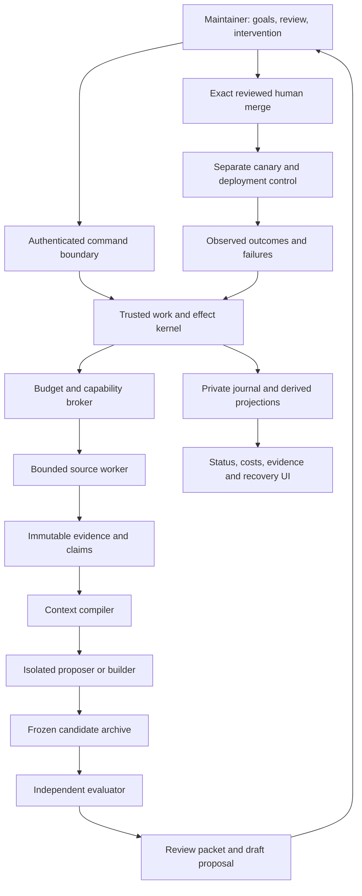

# Living research organization: specification-based delivery plan

Origin: 8 September 2026. Product-direction synchronization: 10 September 2026. Status: non-normative engineering plan for the integrated checkout. This document does not change a specification lifecycle, approve a pull request, grant a capability, or certify production. The canonical contracts remain [the specification program](../specs/README.md).

The [standalone cloud service plan](cloud-research-service.md) supersedes this document's earlier laptop-first, Codex-scheduled and product-wide zero-call assumptions. The deliverable is an open-source service that operates configurable native providers and registered read-only tools, prepares evaluated skill proposals, and issues scoped draft PRs/notifications. The service owns scheduling and private state. Codex is a development client, not the runtime. Earlier measurements remain dated historical evidence; the current data-only service is a developer preview, not accepted production implementation.

Companions: [architecture paper](research-harness-architecture-paper.md), [operator and deployment design](research-harness-operations.md), [current merge assessment](status-and-merge-plan-2026-09-08.md), and [machine-checkable execution plan](spec-execution-plan.json). The machine plan binds the current specification bytes and every visible acceptance checkbox. It is a coverage plan, not acceptance evidence.

## 1. Outcome, non-goals, and critical assessment

Build a research organization that converts observed failures and external research into independently evaluated, reviewable improvements. Its useful output is a better repository and supported research, not a larger volume of agent messages, citations, experiments, or commits.

The closed loop is:

```text
observed failure or research need
  -> authorized, budgeted work
  -> captured evidence and explicit uncertainty
  -> falsifiable mechanism hypothesis
  -> constrained candidate and predicted effect
  -> frozen independent evaluation
  -> archive including failures and costs
  -> review packet
  -> human acceptance of exact repository bytes
  -> separately authorized canary and deployment
  -> monitored outcome and next research need
```

“Self-evolving” means the system can improve permitted skills, prompts, retrieval policies, tools, and eventually harness code through this loop. It does not mean self-authorizing, self-certifying, unlimited spending, silently replacing its objectives, or rewriting accepted history. Every evolutionary step has a stopping condition and a recoverable failure state.

### Current assessment

The integration retains real source capture, provenance-preserving packets, a frozen data-policy experiment, deterministic tests, and a read-only observation UI. The separate `researcher/service` preview now adds service-owned admission, SQLite effect reservations, typed researcher/critic/skill-editor/evaluator calls, frozen body-edit proposals, a draft-only GitHub adapter, and an authenticated loopback status/pause/enqueue API. File and fixture coverage is not evidence that live providers, cloud deployment, or external delivery have passed a canary. The Control Center is not assumed connected. Accepted work-owner integration, independent scientific grading, accepted skill promotion, full recovery and production activation remain absent. Mechanical packing results do not establish research relevance.

The current recovery prototype also lacks authorized continuity reopening: `restore_verified()` can return a writable older prefix and `clear_operator_halt()` does not enforce the future recovery-ticket protocol. The projection path-collision repair does not fix those defects. Use restore only for isolated inspection, never live replacement or halt clearing; see the [event-journal runbook](../../researcher/event_journal/README.md).

Four foundation files are terminal `amended` revision 1; their named revision-2 replacements are absent. SPEC-004 through SPEC-026 are drafts. Existing prototypes cannot satisfy those owner contracts by being renamed. An isolated checkout also cannot prove which lifecycle bytes have been human-merged on protected default. Foundation reconciliation remains necessary for normative acceptance; it does not prevent explicitly scoped, non-authoritative developer-preview work and bounded tests. Keep those two tracks distinct.

The specifications are ambitious enough to hide a delivery risk: a large amount of governance machinery can be built without producing one useful research result. We will counter that risk with vertical demonstrations and explicit deferrals. Twenty-seven contracts do not imply twenty-seven services or twenty-seven continuously running agents.

### Success criteria

There are four separate scorecards:

1. **Integrity:** complete input/result populations, original evidence linkage, exact candidate identity, no unauthorized state transition, no duplicated effect under the tested fault model.
2. **Utility:** held-out downstream task improvement, supported mechanism relevance, useful findings per reviewer minute, and regression rate. Report uncertainty and missingness, not only a mean.
3. **Operations:** recoverable failures, bounded resources, understandable blocked states, measured restore and rollback, and actual scheduled-cycle completion.
4. **Maintainability:** small public interfaces, reproducible installation, runtime independence, traceable rejected approaches, and a measured reduction in recurring maintainer work.

No single weighted scalar may compensate for a critical permission, provenance, or regression failure. Numeric production thresholds must be frozen in the owning evaluation/deployment policy after a sensitivity and capacity pilot, before score-bearing evaluation or a canary. They are not retrofitted to successful runs.

## 2. Research and consequential design decisions

The engineering investigation searched for disconfirming evidence about self-improvement, feedback leakage, and recovery. It is targeted, not a systematic literature review.

- **Open-ended code evolution has useful ideas but weak transfer guarantees.** DGM uses an archive and downstream execution to guide changes. Its current paper also reports objective hacking and explicitly limits the evidence to its tested coding-agent setting. We borrow lineage and empirical testing, not a claim that coding scores establish scientific research ability. [DGM, version 3](https://arxiv.org/html/2505.22954v3).
- **A locked score function is not sufficient.** DGM's authors describe changes that removed detection markers and created false success. Our inference is to bind the evaluator directly to independently captured inputs and complete output populations, not candidate-controlled summaries or logs. [Sakana AI, DGM safety discussion](https://sakana.ai/dgm).
- **Repeated feedback can contaminate a nominal holdout.** Adaptive data analysis studies this failure and provides methods under particular assumptions. Merely calling a dataset hidden does not implement those guarantees. We need evaluator-owned exposure accounting across candidate ancestry, separate calibration, and a sealed confirmatory decision. [Dwork et al., Generalization in Adaptive Data Analysis and Holdout Reuse](https://arxiv.org/abs/1506.02629).
- **Consistent backup is not accepted-history continuity.** SQLite supplies a consistent backup mechanism, but that does not establish that an older backup contains a later accepted suffix or reconciles remote effects. Recovery must compare generation/cutoff evidence and stop on unknown loss. Repeated concurrent writes may also prevent a backup completing, so the supervisor needs a bounded deadline. [SQLite Online Backup API](https://sqlite.org/backup.html).

An independent code review in this iteration reproduced a related local evaluator weakness: the same packet builder supplied both candidate and reference, so symmetric corruption could escape comparison. That is a harness failure, not evidence of an exploit by the current Boolean-only candidate. It motivates an independent source oracle and executable common-mode fault tests.

### Alternatives

| Architecture | Benefit | Main cost or risk | Decision |
| --- | --- | --- | --- |
| Extend the current file loop directly | Fastest route to another local demonstration | Mutable queue/attempt state and split ownership become harder to migrate | Keep as supervised evidence producer; do not add production authority |
| One standalone Python coordinator on a cloud VM, persistent SQLite/artifacts, data-only roles | Small operational footprint, inspectable transactions, replaceable providers, local Docker parity | Single-writer availability limit; clean-host recovery and provider tests still needed | First pre-release target; production follows owner acceptance and gates |
| Hosted workflow engine, distributed queues, database and worker fleet | Durable scheduling and multi-host scale | More identities, failure modes, migration and operating cost | Defer until measured workload or availability requires it |
| Unrestricted agent-code evolution | Large search space and potential stepping stones | Grader gaming, host compromise, noise and evaluation cost | Not the starting system; staged narrow surfaces first |

The largest unresolved uncertainty is semantic utility: whether better evidence and constrained proposals improve held-out tasks enough to justify review and compute. The first study must measure that uncertainty before expanding agent count, models, search breadth, or deployment topology.

## 3. Architecture and ownership



These are responsibilities, not separate services. Initially one cloud coordinator owns durable workflow state and supplies the CLI/API projections. Researcher, critic and skill editor are data-only role calls, not shell-equipped workers. Independently isolated executable-candidate workers and sealed evaluators are later boundaries, not prerequisites to demonstrating a constrained text proposal. Their hidden storage and credentials must not share the builder's filesystem or principal. The preview store is not a second accepted-state plane or full implementation of the diagram.

### Trusted versus evolvable surfaces

| Surface | Ordinary candidate access | Required change path |
| --- | --- | --- |
| Selected skill bodies, examples and declared retrieval/prompt parameters | Read; propose edits inside an exact allowlist | Frozen candidate, changed-surface tests, independent evaluation, human merge |
| Harness implementation | Initially read-only; later specific modules in an isolated experiment | SPEC-020 admission, protected evaluator and kernel, transfer/regression gates |
| Public development fixtures | Read; propose future-epoch additions | Independent fixture review; never relabel current failures as passing |
| Hidden fixtures, thresholds, exposure ledger and grading implementation | No read or write by proposer | Evaluator-owned contract and independent maintainer acceptance |
| Constitution, grants, accepted pointers, secrets and deployment policy | No ordinary candidate mutation | Authenticated human action and owning contract |
| Evidence, attempts, results and accepted history | Append through owner only; no rewriting | Typed correction/supersession with retained lineage |

The kernel enforces the intersection of policy, actor, role, mode, work, environment, isolation, classification and budget. Prompts describe the work but cannot enforce access controls or expand that intersection.

### State ownership

- Public accepted knowledge and releases: exact repository trees accepted through GitHub.
- Research-run migration: legacy files remain authoritative until an accepted cutover; mirrored events cannot create duplicate authority.
- New work, attempts and result application: one canonical owner and journal, not provider sessions or chat history.
- Evidence and context: immutable private artifacts plus explicit access bindings; public output is a separately transformed projection.
- Candidate lineage and experiment outcomes: content-addressed references; no mutable worktree is a frozen candidate.
- UI and notifications: projections and authorized command/delivery intents, never a parallel state machine.

## 4. Delivery protocol: one specification at a time

For every delivery unit:

1. Resolve its exact current specification revision and all direct dependency revisions. Inspect protected-default acceptance separately from local headers.
2. Enumerate the relevant acceptance criteria, invariants, verification cases, public contracts and protected surfaces. Explain any proposed simplification before changing a contract.
3. Obtain the required isolated architecture-review/acceptance transitions. A planning document or chat instruction is not a substitute for a human-merged lifecycle transition.
4. Write failing deterministic tests or a bounded falsification experiment before consequential implementation.
5. Implement the smallest useful contract path, including denial, idempotency, crash and recovery behavior. Do not add the next owner by convenience.
6. Run focused, integration, adversarial, cross-runtime and migration tests appropriate to that slice. Preserve failures and unknown outcomes.
7. Produce an exact source/config/input receipt, runbook, rollback procedure and independently reviewed diff. Empty test catalogs and source-file existence are not passing evidence.
8. Stop at the review boundary. Only the authorized acceptance process advances lifecycle; only SPEC-025 activates a deployment.

The machine execution plan is deliberately unable to mark a criterion passed. Its `unassessed` status distinguishes planning coverage from evidence. The existing lifecycle, inventory, authority and readiness validators remain the owners of their respective questions. A future attestation verifier must bind actual receipts to the final candidate; this planner does not replace it.

### Dependency-ordered delivery units

The exact graph is generated from the canonical specifications. Execute dependency-ready specifications; only the slices within one specification are sequential. Every slice inherits its specification's full dependencies. Existing code paths are reuse candidates, not proof that a slice is accepted or complete.

The numbered catalog is not an instruction to serialize unrelated work. After SPEC-013, runtime SPEC-014 and evaluation-registry SPEC-016 can proceed independently once their own dependencies are satisfied. After SPEC-015 and SPEC-019, private operations SPEC-024 and deployment SPEC-025 need not wait for optional meta-search, adaptive routing or community experiments SPEC-020 through SPEC-023. Operational recovery must not be delayed for speculative optimization. The first release uses a fixed router and closed contributor intake.

#### SPEC-000: constitution and authority

Reconcile the terminal predecessor on protected default before drafting its exact revision-2 replacement. Close the owner action vocabulary, human-only operations, runtime ceilings and deny-by-default mapping. Test every registered actor/action/resource boundary, unknown mappings, policy digest drift, and independent evaluator/attestor identities. The first output is a lawful reviewed authority contract, not a live credential broker. Rollback retains historical decisions and restores only a human-accepted policy revision; it does not erase denials.

#### SPEC-001: repository reconciliation

Reconcile the amended predecessor and replace the contract lawfully. Generate a closed inventory from one pinned source tree, including generated outputs, schemas, skills, claims, examples and local safety corrections. Test deleted/untracked files, symlinks, modes, stale generated data and inconsistent source snapshots. Establish exact baseline evidence for later bootstrap. Rollback regenerates the prior accepted projection from its source tree, not edited inventory rows.

#### SPEC-002: public/private boundary

Reconcile the predecessor and freeze allowlisted export and classification rules. Exercise nested references, seeded credentials and private paths/digests, export-transform drift, and complete public-output population checks. Preserve licensing/access restrictions on captured papers and company material. Verify an independently generated public projection without exporting its private binding. Rollback disables publication and records any necessary exposure incident; deleting a public file is not proof that disclosure was undone.

#### SPEC-003: schemas and artifact identity

Reconcile the predecessor; close canonical byte identity, classified storage binding, editable-surface and freeze semantics. Add Python/TypeScript positive and negative parity for direct-target references, classification high-water, schema/registry drift and exact candidate materialization. Verify migration against retained records without repairing historical bytes in place. Rollback retains old readers or a documented unsupported-version refusal; no silent reinterpretation.

#### SPEC-004: journal and projections

004A first supplies registered event families, separate trusted principal/decision/grant inputs, native versus import paths, repository/organization bootstrap, exact batch identity, append receipts, replay and backup. The existing research-run journal is only a reusable prototype. Test forged inline authority, duplicate acknowledgment after version advance, atomic multi-subject conflict, corrupted projection versus corrupted journal, unknown families, and a latched halt. Then 004B proves the file-first pending-ticket bridge at every fsync/replace/append kill point, including grant expiry after the durable file transition. Recovery must distinguish complete continuation from a declared lossy prefix. Do not connect downstream consumers while a mirror is pending. Rollback disables mirroring, reconciles tickets and preserves both histories.

#### SPEC-005: work, scheduling and recovery

005A implements immutable work specifications, a model-free reducer, two-phase reserve/activate, fencing, logical time, checkpoint/result/application separation and local cost reservation. Run one repository-validation work order with an injected executor before any provider. 005B adds a fake effect adapter, ambiguity reconciliation and shadow queue migration. Test simultaneous reservation, lost acknowledgment, old-fence results, cancellation before/after possible effect, clock rollback/jump, process restart and exhausted budget. Unknown external outcomes never imply retry. Rollback stops admission and fences work, then reconciles effects; it is not a queue reset.

#### SPEC-006: commands and feedback

Implement authenticated command ingestion with actor, exact target, expected version, reason and operation key; then typed human feedback and exceptional recovery commands. First exercise inspect, pause, reject and resume eligibility in isolated state. Test forged identity, stale accepted commit, repeated/colliding command, wrong scope and replay after policy change. No command accepts a self-asserted human field as authentication. Rollback disables admission but preserves command decisions and the work they caused.

#### SPEC-007: GitHub lifecycle

Begin with read-only reconciliation of exact repository/PR/merge observations. Adopt the SPEC-004 baseline once; do not create a second acceptance pointer. Add proposal writes only after an explicit App grant and exact-head permission. Test duplicate/out-of-order webhooks, head/base movement, force-push, deleted branch, review dismissal, check rerun, merge-method differences and uncertain write outcomes. An agent never merges. Rollback revokes proposal capability and continues read-only reconciliation without claiming unseen merges.

#### SPEC-008: status and resource accounting

008A projects source-sequence-bound work, errors, costs and blockers. 008B supplies hierarchical budget reservation and usage reconciliation. Separate forecasts, reserved ceilings, charged usage and unknown billing; retries and failed attempts consume their appropriate budgets. Test stale projection, concurrent reservations, duplicate usage, provider receipt disagreement and partial telemetry. Render no unsupported success or uptime. Rollback retains usage/receipts and stops new reservations rather than resetting spend.

#### SPEC-009: source registry

Define source identity, supported operations, allowed domains/paths, terms/access policy, freshness, shared request reservations and disabled-source behavior. Register arXiv and bounded official company feeds first; keep X staged until its separate contract/cost canary. Test source removal, registry drift, duplicate daily query, cursor identity and unsupported provider fields. Rollback disables future admission while retaining captured evidence and the policy under which it was retrieved.

#### SPEC-010: retrieval and capture

Move bounded source execution behind accepted work/effect contracts. Preserve raw capture, request/response timing, complete versus partial status, parser identity, versioned paper identity and original failure. Add selected primary reading as a separate bounded operation, never an implicit crawler. Test timeout, byte cap, malformed XML/HTML, unsafe redirects/DNS targets, missing capture, changed parser and unknown outcome. Re-extraction consumes retained bytes only. Rollback keeps old captures and parser lineage; it does not refetch by changing a cache key.

#### SPEC-011: evidence graph

Implement claim, mechanism, source occurrence, contradiction, decision and supersession contracts. A claim names support spans and qualifications; a citation is not automatically support and repeated publisher mentions are not independent corroboration. Test orphan citations, version changes, withdrawn work, contradictory evidence, classifier uncertainty and unauthorized promotion. Produce one reviewable supported-mechanism dossier. Rollback appends retraction/supersession and rebuilds views without deleting source history.

#### SPEC-012: context and memory

Compile a context package from exact work, skill, evidence and role inputs under a complete token/byte budget. Include omission reasons, source trust labels, retrieval receipts and checkpoint lineage. Maintain source-to-output identity independently of the packer being graded. Test wrong-method topical distractors, conflicting instructions, Unicode boundaries, oversized inputs, cross-tenant memory, stale checkpoint and complete-prompt budget exhaustion. Rollback selects an accepted compiler version; derived packages get new identities rather than overwritten bodies.

#### SPEC-013: roles, prompts and capabilities

Define researcher, builder, critic, evaluator and operator role packages as work contracts, not persistent personas. Compile prompts with objective, falsifiable hypothesis, inputs, allowed tools/surfaces, output schema, evidence obligations and stopping rules. Separate builder and verifier attempts. Test prompt injection, unauthorized tool requests, contradictory role/work ceilings, hidden-input leakage and unsupported output. Rollback pins prior reviewed role packages and blocks incompatible pending work.

#### SPEC-014: executor/runtime boundary

Implement the runtime-neutral protocol around the standalone Python service, with fake and explicitly configured native-provider adapters. Researcher, critic and skill editor receive bounded attributed data, emit closed output contracts, and cannot execute candidate code or issue effects directly. Registered read-only MCP is a separate restricted tool boundary; arbitrary server discovery, schema drift and model-requested tool escalation fail closed. Hermes is optional, not the initial runtime requirement. Test materialized inputs, exact provider/model/config identity, no-Codex scheduling, output/cost limits, denied tools, credential leakage, restart and ambiguous effects. Later executable workers add independent isolation conformance. Rollback stops adapter admission and reconciles possibly executed operations without erasing reservations.

#### SPEC-015: delivery and review packets

Build inert report/review packet assembly first, then a transactional outbox with destination-specific approval. Bind packet versions, source coverage, contradictions, candidate diff, evaluation and limitations. Test deduplication, partial send, time-window closure, revoked approval, wrong audience and private-data projection. Do not equate a drafted notification with delivered content. Rollback stops delivery and reconciles uncertain sends; it cannot unsend a message by deleting local state.

#### SPEC-016: evaluation registry

Register construct-valid tasks, distinct development/calibration/confirmatory splits, sealed epoch configuration and evaluator-owned exposure-family accounting. Group by underlying task, source/template family and ancestry rather than renamed cases. Test duplicate leakage, candidate-controlled epoch, changed threshold, calibration reused as confirmation and reset-by-new-experiment attacks. A finite deterministic pilot precedes semantic judging. Rollback closes the epoch and starts a new one; prior exposure is never reset or presented as unseen data.

#### SPEC-017: evaluation runner

Run deterministic evaluators first; then independently authorized provider adapters under frozen epoch, cumulative budget and bounded concurrency. Pair baseline/candidate conditions, retain all attempts and reconstruct scores from immutable evidence. Test common-mode oracle errors, incomplete populations, format failure, judge disagreement, selection bias, score tampering, retry cost and ambiguous provider response. Report effect intervals, missingness, exclusions and critical regressions. Rollback quarantines the run or opens a preregistered bridge epoch, never edits a reported score.

#### SPEC-018: candidate archive

Store candidate ancestry, exact changes, evidence, evaluation, failures, search decisions and costs. Distinguish invalid, rejected, useful stepping stone, proposal-eligible and accepted. A non-winning branch may remain research memory without becoming production. Test cycles, missing parent, duplicate ancestry under new labels, stale baseline, archive poisoning and lost artifacts. Bound storage and retain the receipts needed to reproduce decisions. Rollback changes the selected candidate pointer through its owner; history remains append-only.

#### SPEC-019: promotion and release

Compute full base-to-head impact, exact expected merge tree, generated outputs, metadata consumption and independent attestation. Keep accepted-public and promoted-quality pointers distinct; reconcile every ungated intervening change before promotion. Test proposer-as-attestor, critical regression hidden by average gain, base/head drift, squash/rebase differences, stale checks and incomplete cumulative lineage. Only a verified human merge can promote. Rollback is a reviewed revert/correction and new evaluation, not rewriting Git or journal history.

#### SPEC-020: meta-harness laboratory

Only after reliable task-level improvement, admit bounded experiments over declared harness modules. Keep the kernel, evaluator, hidden data, authority and release machinery outside the editable surface. Compare fixed baseline, fixed proposer, constrained search and archive-based search at matched budgets. Test measurement tampering, hidden feedback extraction, runaway descendants, unbounded tool addition and loss of basic editing ability. Preserve failure families and require transfer beyond the optimized tasks. Rollback disables the experiment class and retains its archive; production remains pinned to the last accepted revision.

#### SPEC-021: adaptive routing

Start with an explicit fixed routing policy. Enable adaptive routing only after a sealed cost/quality comparison shows a useful effect. Version features, training/evaluation separation, fallback and cross-model applicability. Test unsupported models, out-of-distribution tasks, mislabeled cost, delayed outcomes, stale policy and hidden-data feature leakage. Rollback restores a prior reviewed fixed router with new event evidence, not silent policy substitution.

#### SPEC-022: community evolution

Accept public contribution packets as untrusted proposals with declared provenance, licensing, surface changes and reproducibility instructions. Independently replay them in isolation without contributor credentials or public authority. Test malicious archives/paths, forged receipts, incompatible versions, plagiarism/provenance gaps and resource exhaustion. Bound review admission and quarantine unexplained artifacts. Rollback disables ingestion or withdraws a projection; it never grants community code control over trusted infrastructure.

#### SPEC-023: open-source governance

Publish contributor/reviewer roles, correction and disclosure process, change taxonomy, release evidence and accountable maintenance ownership. Automate issue triage and stale-claim proposals only behind approved interfaces. Test representative contribution, disputed evidence, embargoed security report, release correction and unavailable maintainer paths. Measure review burden and accepted useful changes, not stars or post volume. Rollback suspends automation and preserves traceable human ownership.

#### SPEC-024: private control plane

Bind authenticated principals, tenant scope, credentials, private artifact access and audit retention in the standalone service. Development environment/mounted-secret references and planned cloud secret-store/OIDC/GitHub App adapters use explicit portable bindings, never ambient developer accounts. Separate source/model/MCP/proposer/delivery scopes; standing operator configuration may authorize routine draft PRs and notifications, not merges or recipient expansion. Test cross-tenant reads, revoked/expired identity, grant replay, destination mismatch, rotation, redaction, backup access and private/public boundaries. The preview's bearer API and environment references are reuse candidates, not a complete broker. Rollback revokes admission safely, preserves incident evidence and reconciles work; secrets never enter public configuration.

#### SPEC-025: deployment and recovery

The revised draft targets the standalone Python service under local Docker and one single-tenant Linux cloud VM, with SQLite and private artifacts on persistent local disk and one active coordinator. Codex, launchd and a maintainer laptop are not runtime dependencies. Choose provider, region, machine size, residency, budget and retention through an explicit deployment decision; none is selected here. Prove exact image/config identity, authenticated ingress, admission pause, bounded canary, encrypted backup/restore, deployment-pointer change, effect reconciliation and rollback. Test clean-host installation, downtime, disk exhaustion, old backup, stale WAL, interrupted upgrade and dependency outage. PostgreSQL/Temporal require measured need, shadow parity, one-writer cutover and a reviewed migration, not an automatic cloud prerequisite.

The `BackupGenerationBarrier` must close matching journal, CAS/artifact bytes, private-index/policy/schema/adapter/manifest generations, accepted/active commits, leases/reservations, pending tickets and outbox/ambiguous effects. It contains no live capability; recovery-key custody is separate. Test missing artifacts, wrong generations and incomplete cutoff denial. Irreversible schema/artifact migration must refuse automatic binary rollback and require accepted forward recovery while retaining events written by the failed deployment.

#### SPEC-026: training deferral

Produce a deterministic readiness or deferral dossier for weight-level learning. It must name the target failure, why harness/tool/context changes are inadequate, data rights, contamination controls, compute cost, evaluation and rollback. Missing evidence means deferred, not a placeholder training job. Test that no dossier or score activates training. Any future training path requires its separately human-merged activation amendment and provider/security review.

## 5. Vertical demonstrations and measurable exit gates

| Demonstration | Actual work | Exit evidence | Deliberately absent |
| --- | --- | --- | --- |
| D0: trustworthy development plan | Inventory contracts and acceptance coverage; reproduce/fix existing integrity failures | Exact spec drift rejection and negative tests; no acceptance claim | Owner activation |
| D1: durable model-free work | Submit a repository-validation task, reserve, execute, restart and apply | One result application, old-fence denial, replay-equal state, tested restore | Model, network and GitHub writes |
| D2: evidence-to-report | One accepted source operation to captured primary evidence, qualified claim and inert report | Complete provenance, partial/failure handling, source-to-claim review | Autonomous scientific acceptance |
| D3: constrained improvement | One supported hypothesis, one narrow candidate, independent paired evaluation | Useful held-out effect under frozen rules and no critical regression | Self-merge or grader edits |
| D4: reviewed release | Independent exact-tree attestation and human acceptance | Reconciled merge, contiguous quality lineage, reproducible package | Automatic deployment |
| D5: canary organization | Scheduled bounded work, authenticated UI, operator pause/recover/reject/rollback | Measured duration, costs, incidents, restore and operator-task success | Unbounded autonomy |
| D6: bounded meta-improvement | Search permitted harness surfaces against fixed controls | Transfer, feedback-exposure discipline, net utility and complexity accounting | Kernel/evaluator/authority evolution |

D1 is the first production-shaped substrate milestone, but it cannot begin as an accepted implementation until foundation and SPEC-004/005 acceptance is lawful. Development-only test repairs and plan tooling do not cross that boundary. A demonstration is a workload, not a substitute for its complete owner dependencies.

The cloud preview follows the parallel C0-C5 workloads in [the cloud service plan](cloud-research-service.md): standalone runtime, real research path, evaluated proposal, scoped effects, clean-cloud pre-release, then production evidence. It can exercise configured APIs before normative acceptance, but may not rename synthetic fixtures, pairwise model preference or local tests as an accepted implementation or scientific effectiveness.

## 6. Research and benchmark protocol

### Source-to-insight study

Freeze information needs before retrieval. Include mechanism-specific queries, same-topic/wrong-method negatives, older relevant work, empty-result needs, conflicting findings and renamed/revised papers. Compare the current literal control, facet lanes and recency at matched request, packet and reviewer budgets. Company feeds are publisher windows; X posts are leads with access/cost constraints. Neither is automatically a paper or independent support.

Pool and blind candidate assessment. Judge topical relevance, mechanism relevance, claim support, limitations and actionable test design separately. Record unjudged documents and reviewer disagreement. Use need/source families for uncertainty and split boundaries. A precision estimate on the judged pool is not exhaustive recall over arXiv.

### Skill and harness effectiveness study

The first useful conditions are no-skill baseline, current accepted skill, candidate skill, and a matched-context-length control. The context compiler, tools, model/settings and task artifacts are pinned. Use deterministic task outcomes where possible; use calibrated independent semantic judges only for properties without an objective oracle. Composition adds order, conflicting guidance and competing context demand as separate conditions.

Report paired need-level/task-level effect sizes and intervals, per-skill confusion and critical regressions, total compute/latency/cost, retry/format/timeout rates and reviewer time. Predeclare the comparison family, missing-data rule, stopping rule and practically useful effect. A sensitivity pilot estimates variance and cost; it does not count toward confirmatory evidence after it influences design.

### Longitudinal self-evolution study

Compare a fixed system, repeated independent proposals from a fixed builder, and archive-guided proposals with equivalent resource ceilings. Measure cumulative useful accepted improvements, held-out transfer, regressions, complexity and review burden over actual successive accepted versions. Account for all proposed and failed candidates. Record evaluator feedback exposure across related lineages; renaming a task, candidate or experiment cannot reset the budget. Do not use acceptance count alone as quality.

The paper's evidence package should contain preregistration, source/dataset provenance, reproducible code and environment, permitted public data or reconstruction instructions, missingness and negative results, actual runtime/cost records, threat model and limitations. Private source text, credentials and hidden fixtures stay private. A public reproducibility limitation is disclosed, not concealed with a fixture-only replay.

## 7. Agent prompts, results and human interaction

Use a shared typed prompt envelope: work/attempt/fence; objective; explicit hypothesis; input artifact references; source trust; allowed operations and editable surfaces; output contract; resource reservation; failure/stop conditions; evidence obligations; and progress cadence. Prompt text is versioned causal input. No hidden model-generated expansion or extra reviewer is added without its cost and benefit being measured.

The researcher emits a mechanism dossier with counterevidence and missing evidence. The builder emits a constrained candidate and tests. The critic emits narrow independently checked failures, not one broad confidence score. The evaluator emits population-complete results. The report assembler consumes those records and cannot turn a prose claim into success. The operator sees queued, active, partial, unknown, rejected, proposal-ready, accepted and deployed as distinct states.

Minimum authenticated operator tasks: nominate a need; inspect exact evidence and omissions; see reserved/used/unknown cost; pause new admission; reject a candidate; diagnose a stopped attempt; provide an authorized recovery disposition; inspect exact diff/evaluation; and initiate a separately authorized rollback. A button is not complete until its command, reducer, failure and duplicate paths are tested. The preview's loopback API covers status, pause/resume and configured-schedule admission; it is not the complete command model, recovery interface or connected Control Center.

## 8. Deployment, budgets and stopping

Do not add the model loop to a developer heartbeat. The standalone service's foreground `serve` process owns scheduling and work; Codex observations and dormant launchd wrappers are not dependencies. A timer proposes work; admission rechecks identity, deduplication, pause and budgets before each effect. Normative production scheduling still requires accepted owner and deployment controls.

The historical benchmark runner and packet-policy experiment remain zero-call. The separate service may call explicitly configured native APIs under `--live`, bounded reservations and private credential references; possession of a key is not permission to expand scope. X is not a configured service source in this slice. Source request/page/byte/time and daily cache-reservation limits remain controlling. Process, memory, disk, artifact, retry and cost ceilings must be verified in the executor canary. No deployment size, bill, availability, RPO or RTO is presented as measured.

Stop or quarantine on identity drift, unavailable evidence, unknown effect, unbound evaluator population, permission mismatch, excessive exposure, exhausted resources or a critical regression. An idle/no-work cycle is healthy; do not manufacture research to appear active. Record actual completions and missed cycles, not an inferred continuous uptime span.

## 9. Work in this iteration and next acceptance boundary

The September 8 iteration delivered D0 planning and targeted prototype repairs; its [dated results](living-organization-results-2026-09-08.md) are not overwritten. September 10 adds the standalone service preview and draft cloud-direction changes. Neither implements all 27 owner contracts. The machine plan retains every criterion as unassessed even when a historical checkbox is checked.

Normative acceptance still needs protected-default foundation reconciliation and lawful replacement-revision review. The [cloud PR plan](cloud-pr-plan-2026-09-10.md) separates those changes from bounded service implementation and effect canaries; no PR is merged by this plan. The immediate development work is clean-install/provider/effect/recovery testing and an independently controlled usefulness study, not waiting to create a larger agent organization.

### Machine-plan synchronization

`python researcher/scripts/spec_program.py plan` emits an intentionally incomplete template from current specification bytes; it must not overwrite a populated plan. Reconcile through `build_program(root)`: retain each spec's objective, ordered slices and existing code touchpoints, then retain verification methods only for exactly matching criterion IDs. Copy all source-owned fields, dependency order and blockers from the fresh observation. Review new/changed criteria and supply explicit verification methods; do not transfer a checkmark or result across changed text. Leave every state `unassessed`, retain unchanged records, and apply the reviewed diff. Validate with `python researcher/scripts/spec_program.py check docs/product/spec-execution-plan.json`. This is source-bound planning, not an evidence migration or lifecycle transition.

The definition of done for the complete product includes semantic effectiveness, hostile-worker isolation, clean installation, authenticated operator tasks, exact-head release verification and real restore/canary evidence. Those remain open. “Nothing missing” is approached through contract and test coverage plus adversarial review, not asserted as an absolute guarantee.

## Sources and research record

- [DGM paper, version 3, method and limitations](https://arxiv.org/html/2505.22954v3).
- [Sakana AI, DGM safety and objective-hacking discussion](https://sakana.ai/dgm).
- [Dwork et al., adaptive data analysis and holdout reuse](https://arxiv.org/abs/1506.02629).
- [SQLite Online Backup API](https://sqlite.org/backup.html).

Search output: `/tmp/living-research-organization-20260908-search.json`. Targeted extraction output: `/tmp/living-organization-primary-sources-20260908.json`. These are engineering research records, not product research campaigns or model-benchmark results. The research skills directed primary-source discovery and extraction; independent code review supplied the local falsifying experiment. No cited external benchmark was reproduced here.
