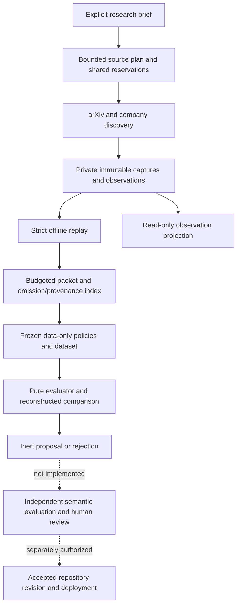

# Evidence-Bound Research-to-Proposal: Architecture of a Portable Improvement Harness

Technical paper draft, 8 September 2026. Status: implemented local prototype with a proposed production extension. Not a completed research study, peer-reviewed paper, accepted specification, or production attestation.

Companions: [current status and merge plan](status-and-merge-plan-2026-09-08.md), [deployment and operator design](research-harness-operations.md), [evaluation protocol](portable-harness-paper-protocol.md), and [measured experiment results](portable-harness-results.md).

## Abstract

Maintaining an agent-skill repository requires more than retrieving recent papers and rewriting instructions. An improvement system must distinguish discovered material from supported claims, a candidate from an accepted change, and successful execution from useful research. We describe a portable research-to-proposal harness within Agent-Skills-for-Context-Engineering. Its implemented path combines bounded public-source discovery, immutable capture, provenance-preserving context construction, frozen data-policy candidates, deterministic evaluation, replay verification, and inert proposals. A retrospective experiment on two retained source campaigns compares two predeclared packet representations. On the larger, 56-work input, compact provenance increases selected records from 29 to 42 at a 131,072-byte ceiling, while preserving selected text and reconstructable provenance. This establishes a mechanical integration result, not better semantic retrieval or autonomous scientific discovery. We specify the additional ownership, isolated execution, evaluation, operator, and promotion boundaries needed for a self-improving open-source system. Those extensions remain proposed; model-driven research, accepted skill updates, autonomous merging, and production deployment are not enabled.

## 1. Problem and scope

The desired outcome is a repository that produces useful, independently defensible improvements with less recurring maintainer work. The optimization target is not agent count, papers retrieved, tokens consumed, or frequency of commits. It is supported improvement per unit of compute, elapsed time, and human review, subject to correctness, security, and maintainability constraints.

The software is intended to run from ordinary CLIs, CI, or compatible agent runtimes. Codex currently supplies engineering assistance and a bounded development heartbeat, not the product's canonical state or a required deployment dependency. The code can be open source while tenant credentials, licensed source bodies, hidden evaluation data, and operational receipts remain private.

We distinguish three artifacts that are easily conflated:

1. **Public skill corpus:** versioned instructions, mechanisms, claims, fixtures, packaging, and historical benchmarks.
2. **Local research prototype:** supervised retrieval, evidence/context construction, and data-only comparison.
3. **Target improvement product:** accepted work, isolated agents, independent evaluation, proposal review, and separately authorized release/activation.

The local integration is an uncommitted working tree based on `c6cd52017b247804373339e1c3c103d42554b0a1`. That commit does not identify the later improvements. Local verification receipts bind source/runtime identities; they are not evidence that the changes are on protected `main`.

### 1.1 Research questions

- **RQ1, integrity:** Can the harness preserve input/candidate/result identity and reject corrupt, incomplete, or unauthenticated evidence without inventing success?
- **RQ2, research utility:** Does evidence-guided proposal generation outperform fixed and cost-matched search alternatives on independent research needs?
- **RQ3, downstream effect:** Do accepted skill or harness changes improve held-out task performance without material regressions?
- **RQ4, operations:** Can the system resume, reconcile ambiguity, and support operator intervention without duplicated effects or uncontrolled spending?

Current evidence addresses finite cases of RQ1 and local recovery aspects of RQ4. RQ2 and RQ3 remain unmeasured. The design is not a proof of general recursive self-improvement.

## 2. Related work and design implications

**ADAS** separates search space, search algorithm, and evaluation function, and demonstrates code-defined agent search. We adopt the separation, not its reported performance: our implemented search space contains only two data policies, not an open-ended agent program space. [Hu, Lu and Clune, Automated Design of Agentic Systems](https://arxiv.org/abs/2408.08435), method inspected in [version 2](https://arxiv.org/html/2408.08435v2).

**Darwin Gödel Machine** explores self-modifying agents with an archive. Its Appendix H also reports objective hacking through altered logging markers. Our engineering inference is that protecting grader code is insufficient when a candidate can alter the evidence being graded. Input lineage, complete populations, and independently reconstructed scores must be protected as well. [Zhang et al., Darwin Gödel Machine](https://arxiv.org/abs/2505.22954), [version 2, Appendix H](https://arxiv.org/html/2505.22954v2).

**AlphaEvolve** uses executable evaluation to guide program evolution and supports evaluation cascades. Its requirement for automatically gradeable outcomes limits direct transfer to scientific relevance and claim support. We therefore start with exact byte/provenance invariants and keep semantic evaluation separate. [Novikov et al., AlphaEvolve](https://arxiv.org/abs/2506.13131), [version 1, Sections 2.1 and 2.4](https://arxiv.org/html/2506.13131v1).

**Adaptive data analysis** shows why repeated feedback can overfit a holdout. A versioned test suite alone does not inherit the guarantees of a reusable-holdout algorithm. Our proposed study separates development, selection, and sealed final data and records feedback exposure. [Dwork et al., Generalization in Adaptive Data Analysis and Holdout Reuse](https://arxiv.org/html/1506.02629v2).

This is a targeted design review, not a systematic literature survey. No cited paper's benchmark is reproduced here. The proposed contribution is an auditable integration of evidence, bounded experimentation, and authority separation; priority or superiority over other systems is not established.

## 3. System model and invariants

### 3.1 Identities and provenance

Let `H(x)` denote SHA-256 of exact bytes. Structured records use the repository's integer-only canonical JSON profile before hashing. Hash identity is not a signature, access permission, or truth judgment. An artifact reference must resolve through an authorized private storage binding; it must not expose a private locator or confer authority.

Every experimental outcome must bind the input dataset, candidate policy/tree, evaluator implementation, runtime/dependencies, and experiment plan. A different implementation or context is a different identity. That identity change does not reset a daily retrieval reservation or authorize repeating an uncertain effect.

For a packet with work universe `W`, selected set `S`, and omitted set `O`, mandatory properties are:

```text
S ∩ O = ∅                       complete, nonoverlapping accounting
S ∪ O = W                       no silent work deletion
bytes(canonical(packet)) ≤ B    exact declared context ceiling
expand(provenance(packet)) = original occurrence index
selected record text = original selected record text
```

The complete reference must itself be constructible within its reference limit. Otherwise preservation is unproven and the condition fails. A preserved incorrect abstract is still incorrect; these are integrity properties, not scientific validation.

### 3.2 Authority

The target action set is the intersection of constitutional policy, work authorization, role ceiling, environment, isolation, capability grant, data classification, and remaining budget. Neither a prompt nor an agent's own output may enlarge that set.

The current experiment records explicitly declare `authority: none`. The registered organization-event path concerns research-run transitions, not a new accepted experiment/evaluation/promotion lifecycle. This prototype does not manufacture accepted contracts to bridge that gap.

### 3.3 Trust model

Remote documents, RSS content, model output, candidate edits, and community contributions are untrusted data. Source instructions must not become tool permissions. The current data-only candidate cannot execute Python, shell, or arbitrary code. The maintainer's local OS account is assumed cooperative. File modes, locks, and hash checks do not isolate hostile code running as the same user.

## 4. Implemented architecture



The diagram shows data dependency, not a single integrated production transaction. Source campaigns are completed separately and imported into the experiment. Dashed edges are missing product integration.

### 4.1 Module ownership

| Module | Owns | Does not establish |
| --- | --- | --- |
| `source_connectors.py` | Bounded adapter requests, parsing, source metadata and receipts | Scientific relevance or support |
| `research_evidence.py` | Capture/checkpoint persistence and replayable evidence | Accepted organizational facts |
| `research_sourcing.py` | Explicit lanes, shared arXiv policy reservation, campaign identity, primary selection and replay | Cross-host scheduling or semantic search |
| `research_articles.py` | Inert HTML extraction and extracted-text spans | Full PDF coverage or verified paper conclusions |
| `research_context.py` | Explicit corpus-skill selection under byte limits | Learned semantic retrieval |
| `research_discovery.py` | Work pooling, round-robin selection, compact provenance and omissions | Relevance ranking or independent corroboration |
| `research_pipeline.py` | Local observation execution, report/handoff, verified read and bounded view publication | Researcher/evaluator execution or accepted results |
| `research_experiment.py` | Strict dataset/policy checks, pure evaluation and exact comparison | Statistical significance or promotion |
| `research_evolution.py` | Frozen private candidates, intents/outcomes, identity-bound resume and CLI | Generated hypotheses, executable candidates, repository writes |
| `artifact_store.py`, `schema_contract.py` | Canonical identities, private bindings, candidate/freeze primitives | Permission to read or apply arbitrary artifacts |
| `local_scheduler.py` | Local schedule/work/lease prototype and terminal accounting | Canonical organization-wide acceptance |
| `event_store.py`, `run_projector.py` | Separate event-journal/projection prototype | Integrated scheduler/experiment transaction |
| `prompt_compiler.py` | Typed role/context/tool/budget prompt compilation | Runtime enforcement or evaluator independence |
| `apps/control-center` | Observation display and separate fixture controls | Hosted authentication or authoritative commands |

These modules live under `researcher/scripts/` unless otherwise noted. Separate local journals and per-run scheduler databases are a remaining integration problem, not intentional production sharding.

The journal prototype validates record structure, idempotency and expected subject version; it is not yet a trusted-principal/capability decision engine. Its schema accepts `research_run.*`, not experiment events. The scheduler has mutable `queued -> running -> succeeded|failed` rehearsal records. Those records are not the proposed immutable attempt/reservation/result-application chain. A source run reaching `awaiting_researcher` or `partial` is not an accepted research conclusion.

### 4.2 Source acquisition

A brief names the question, relevant skill IDs, purpose-labeled lanes, packet limit, and staged X queries. arXiv supports title/abstract-scoped terms or phrase queries and distinct relevance/recency orderings. Work identity groups versions without erasing the retrieved version, dates, categories, DOI, source URL, or occurrence.

Company adapters read bounded official publisher windows for DeepMind, Hugging Face, and Microsoft Research. They do not perform exhaustive topic search. Publisher affiliation is not corroboration, and crossposting a paper does not create independent evidence. X parsing has fixture coverage, but authenticated wire behavior, entitlements, and resource-based billing remain unvalidated; X is staged only.

Recurring development sourcing uses one shared cache, retained query reservations, and at most one fresh campaign per UTC day. Existing limits cap campaigns at eight lanes and 256 KiB of packet data. The current brief has six lanes and a 128 KiB packet cap. Company lanes permit one request/page, up to 20 items, 500,000 response bytes, and 15 seconds each; actual source windows can contain fewer items. Caps do not imply every response completes.

A primary-page request must select a discovered allowed URL and pass its stricter host/path/DNS boundary. Extraction is inert: no JavaScript, automatic link crawling, or arbitrary code. Raw HTML and extracted text have separate identities. Span offsets refer to extracted text, not raw HTML. A parser repair may create a separately bound offline re-extraction; it must preserve the original failed result.

Primary article attachments are not imported by the current packet experiment: `dataset_from_campaigns` consumes discovery lead observations. Reading a primary page therefore does not silently turn the experiment into full-paper synthesis.

The [sourcing design](sourcing-research/report-source.md) records the source/API evidence, constraints, and intentionally deferred alternatives.

### 4.3 Context construction

The compact representation stores shared provenance once and references it from occurrences. The expansion function reconstructs the original occurrence index. Text for a selected work is unchanged. Selection is whole-work round-robin across lanes, making source participation inspectable, but not necessarily optimal for relevance or downstream utility. Large evidence/provenance overhead can reduce selected coverage even when raw lead count increases.

The next semantic experiment must compare query/facet and selection policies on frozen candidate pools. Introducing a vector database or a model reranker before measuring this baseline would add operational cost without an established bottleneck.

### 4.4 Frozen data-policy experiments

The complete candidate grammar is:

```json
{"schema":"packet-policy/v1","compact":true}
```

The other candidate changes only `compact` to `false`. The declared editable file exists inside the frozen candidate materialization, not as a live repository policy changed by the experiment.

The dataset permits at most 16 cases and 4 MiB of canonical input. Case/budget conditions are bounded to 48 per policy; the experiment plan also gates total logical evaluation rows across policies. Each case declares its group, question, observations, and budgets. A caller's group label is not evidence of independence.

For a valid condition `i`, the descriptive objective is the lexicographic pair:

```text
V_i(policy) = (selected_work_count, -packet_byte_count)
```

The comparator first recomputes both complete input-bound evaluations. An unavailable pair yields `insufficient_evidence`; otherwise any worse pair yields rejection. At least one better pair and no worse pairs yields `candidate_dominates`; all-equal yields `no_improvement`. The orchestrator can then emit `proposal_ready`, with application disabled. It does not accept candidate-authored score claims.

### 4.5 Lifecycle and recovery

Conceptually, the implemented private lifecycle is:

```text
validate/import -> bind manifest and inputs -> attempt intent
  -> freeze/materialize -> evaluation -> terminal outcome
  -> recomputed comparison -> inert report

intent without terminal outcome: UNKNOWN_OUTCOME; stop for inspection
```

This is not an additional accepted organization state machine. Existing run-state transitions remain governed by their own commands and schemas.

The intent is persisted before candidate freezing and materialization. An interruption in either phase is therefore already an unresolved attempt, not harmless pre-intent preparation.

Resume checks manifest, source, runtime, and dependency identities. Missing results are not treated as permission to reissue work. Read-only replay requires existing storage/locks and a completed, checkpointed scheduler database. It refuses nonempty WAL/journal files rather than silently checkpointing them. Verification must not initialize, chmod, or repair evidence. Deadlines in the data runner are cooperative checks between phases, not hard process watchdogs; initial import and individual phases have documented limitations.

The imported experiment is not a self-contained portable archive: verification reopens the original campaigns/captures through private locations. Copying only the experiment CAS is insufficient. Identity currently includes all top-level researcher scripts, schema JSON, exact Python version and `jsonschema` version, so even unrelated script changes can invalidate resume. This conservative coupling is a reproducibility constraint to refine through explicit compatibility contracts, not bypass by weakening hashes. Operational exceptions may leave an intent requiring inspection rather than a durable terminal outcome.

## 5. Agent organization and the proposed improvement loop

The minimal target separates responsibilities, not necessarily long-lived processes:

| Responsibility | Input and output | Independence requirement |
| --- | --- | --- |
| Coordinator | Eligible work and budgets to bounded attempts | Sole accepted work-state owner; no research truth judgment |
| Curator | Captured sources to attributed claims, counterevidence and testable mechanism | Cannot promote its own claims |
| Builder | Authorized hypothesis/context to bounded candidate | No hidden final labels, release credentials or evaluator writes |
| Evaluator/critic | Frozen candidate and independently controlled tasks to observations | Candidate cannot edit its inputs, grader, logs or verdict |
| Report assembler | Verified outcomes to evidence-linked review packet | Must preserve failures, uncertainty and all denominators |
| Maintainer/release authority | Exact reviewed candidate to accepted change | Authenticated outside proposer; deployment is a separate decision |

The compiler's builder/verifier role packages are not operational agents. This project's development subagents are also not evidence that the product runs a multi-agent organization.

The target loop is `traces -> failure family -> research need -> candidate -> evaluation -> proposal -> authorized release -> new traces`. Initially, data/document surfaces should be the only eligible improvement targets. Code search requires a separate hostile-execution boundary. Evaluator changes require their own fixed experiment and independent anchors, never a mid-run rule change to rescue a candidate.

## 6. Empirical evidence

### 6.1 Retrospective packet case study

The policies were known before the experiment. Two previously captured campaigns supplied six case/budget conditions: one 56-work input and one three-work follow-up. Reversing the policies is a negative control, not another independent population.

| Input | Budget bytes | Original selected / bytes | Compact selected / bytes |
| --- | ---: | ---: | ---: |
| 56 works | 65,536 | 2 / 65,182 | 15 / 65,288 |
| 56 works | 131,072 | 29 / 130,807 | 42 / 130,801 |
| 56 works | 262,144 | 56 / 214,203 | 56 / 189,526 |
| 3 works | 65,536 | 3 / 11,103 | 3 / 9,606 |
| 3 works | 131,072 | 3 / 11,104 | 3 / 9,607 |
| 3 works | 262,144 | 3 / 11,104 | 3 / 9,607 |

The forward comparison produced an inert proposal; reversing incumbent and candidate produced rejection. Both directions contained 12 logical evaluation rows, reusing the same six conditions. Replay/resume reproduced saved results. No HTTP, model, or paid call occurred inside this experiment. Earlier acquisition and engineering research are separate costs. These observations are documented in the [dated results report](portable-harness-results.md), not presented as a confidence interval or a search-algorithm benchmark.

### 6.2 Verification versus validity

The prior frozen-source Python run passed 1,078 tests in 225.740 seconds on Python 3.12.9. The separate 37-case lifecycle suite passed on Python 3.11.0 and 3.12.9 on the same machine. An additional 143 publication/inventory/product-readiness tests passed after the prior documentation changes. These overlapping suites must not be added into an invented independent-test total. [Verification scope](portable-harness-results.md#verification).

Tests cover malformed identities, booleans substituted for integers, forged scores, incomplete references, missing locks/state, CAS corruption/aliases, time limits, and unknown outcomes. Local filesystem tests do not prove distributed durability or hostile-process isolation. Stage 0 ran checks but zero benchmark scenarios; activation fixtures are deterministic smoke tests, not model routing or skill effectiveness.

The current daily retrieval and offline-cycle totals are recorded in the [dated status report](status-and-merge-plan-2026-09-08.md). They are deliberately separate from this fixed experiment. New source windows must not be inserted into the old table and represented as a controlled policy delta.

## 7. Evaluation required for a research claim

The [paper protocol](portable-harness-paper-protocol.md) is a proposed preregistration. It is not complete until sample size, useful-effect thresholds, resource ceilings, splits, and analysis code are frozen before final-set access.

Use underlying research need or failure family as the experimental unit. Nest papers, versions, query variants, candidate revisions, and stochastic repetitions within that unit. Compare incumbent, frozen-archive selection, random search, and evidence-guided search under the same candidate grammar and maximum resources, while reporting actual usage and archive preparation costs. The present two-policy space has an exhaustive oracle and cannot support an interesting search-efficiency claim.

Semantic evaluation should separately judge topical relevance, implementable mechanism, local support, counterevidence, and preservation obligations. Use blinded independent reviewers and report pre-adjudication disagreement. Downstream tasks compare no-skill, incumbent, selected candidate, and unrelated-change controls on sealed tasks. Candidate authors must not see final labels or detailed final feedback.

Freeze a primary endpoint and practical effect threshold; use a development-only pilot for variance and feasibility, then determine sample size. Preserve paired, need-level inference and report 95% intervals with preregistered multiplicity correction. Retain invalid, rejected, timed-out, cancelled, and unknown trials. More successful completions must not hide a worse unavailable-outcome rate.

## 8. Threats to validity and deployment limitations

- **Construct validity:** selected records and preserved bytes are not relevance, truth, novelty, or task success.
- **Selection bias:** the development example is one narrow memory-related investigation with a broader follow-up, not a representative sample of independent needs.
- **Adaptive bias:** the compact representation was built before the measured comparison; no preregistered superiority claim is supported.
- **Exposure:** current development data and tests are visible to the engineering agents. Hidden-evaluator isolation is proposed, not measured.
- **External validity:** interpreter checks on one macOS machine do not prove clean Linux installation, Windows support, multi-host replay, or real provider behavior.
- **Source coverage:** bounded feeds miss content outside their windows; abstracts and supported HTML exclude inaccessible or oversized papers. X remains live-unverified.
- **Security:** cooperative local hashes/locks are not adversarial containment. Source prompt injection is treated as a boundary concern, not claimed solved.
- **Operations:** sparse hourly receipts are not continuous uptime. Off-host restore, hard worker limits, authenticated command handling, and production canaries remain unverified.
- **Reproducibility:** raw research captures are private. Public redistribution needs licensing review and validated export; synthetic fixtures are not substitutes for the real-data population.

## 9. Release and reproducibility plan

First reconcile the existing PR train and independently review exact heads. Then split local improvements into bounded, reviewable changes. Accept missing owner contracts through their normal lifecycle before connecting production work, evaluation, and promotion. Publish the CLI, fixtures, locked requirements, source/config digests, failure cases, and replay commands. Ship neither private run directories nor provider credentials.

A first deployment should minimize trusted state owners and keep executable candidate isolation separate. The [operations design](research-harness-operations.md) recommends a single-tenant supervised node first; the older managed-cloud topology is a later scaling option, not a prerequisite for the paper or MVP. A clean-install/restore demonstration must precede portability or reliability claims.

## 10. Conclusion

The implemented system is a bounded, inspectable source-to-data-policy-proposal prototype. Its strongest current result is preservation and reproducibility of a narrow improvement experiment, with explicit negative outcomes and no automatic application. The central remaining research problem is whether independently evaluated source-to-skill changes improve unseen tasks economically. The central remaining engineering problem is connecting accepted work, isolated execution, and human-controlled release without introducing competing state owners. Neither problem is solved by adding more agents alone.

## References and access notes

Primary sources checked on 8 September 2026. Methods and relevant failure/limitation sections were inspected; experiments were not reproduced.

- Hu, S., Lu, C., and Clune, J. [Automated Design of Agentic Systems](https://arxiv.org/abs/2408.08435), 2024; method source [v2](https://arxiv.org/html/2408.08435v2).
- Zhang, J., et al. [Darwin Gödel Machine: Open-Ended Evolution of Self-Improving Agents](https://arxiv.org/abs/2505.22954), 2025; failure source [v2, Appendix H](https://arxiv.org/html/2505.22954v2).
- Novikov, A., et al. [AlphaEvolve: A coding agent for scientific and algorithmic discovery](https://arxiv.org/abs/2506.13131), 2025; evaluation source [v1](https://arxiv.org/html/2506.13131v1).
- Dwork, C., et al. [Generalization in Adaptive Data Analysis and Holdout Reuse](https://arxiv.org/html/1506.02629v2), 2015.

Discovery record: one bounded Parallel Search request, followed by primary-paper inspection. Search output for local follow-up: `/tmp/research-harness-architecture-20260908-search.json`. The engineering literature lookup is not a product sourcing campaign or an effectiveness benchmark. No exhaustive or latest-best-method claim is made.
