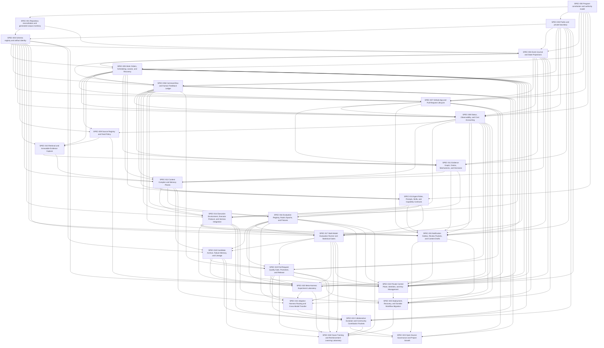

# Autonomous AI Research Organization: Specification Program

Status: active roadmap
Date: 2026-08-10
Architecture decisions: [ADR index](../decisions/README.md)

## Purpose

This program converts the architecture into 27 reviewable implementation contracts. It is ordered so each pull request creates a usable layer, preserves the current repository, and supplies evidence needed by later layers.

The program is not a backlog of features. Each specification fixes an interface, authority boundary, state transition, or quality gate. Implementation details may change inside those contracts. Merging this roadmap publishes SPEC-004 through SPEC-026 as draft contracts; it does not accept them. It also performs the explicitly bounded lifecycle adoption for already merged SPEC-000 through SPEC-003 described below. Every later acceptance requires an isolated status transition in a human-merged pull request. A change to an accepted contract requires a digest-linked specification amendment and a human merge.

## Delivery rules

1. One implementation pull request should normally implement one specification or one explicitly named vertical slice of it. A named slice inherits the specification's complete `Depends on` set and its listed slices execute in order; a slice that needs a different or forward dependency must become a separate specification so the machine-checked graph remains complete.
2. Agents may create branches, commits, pull requests, review packets, and follow-up commits. Agents may not merge, bypass required checks, alter branch protection, or declare their own candidate promoted.
3. Human merge is the only public acceptance or promotion event. Deployment activation is a separate SPEC-025 event and cannot precede the accepted merge.
4. Every state-changing command carries an actor, source event, target, reason, idempotency key, and expected prior version.
5. Canonical state is repository or control-plane data, never chat history, an agent session, or a framework-private database.
6. All external runtimes use versioned adapters. Hermes is the first operator runtime, not the organization database.
7. Evaluation policy, constitution, merge authority, hidden tests, and editable-surface policy are outside ordinary optimizer control.
8. Organizational-effect modes form `observe < shadow < proposal < production`. Mode, data-classification ceiling, action grants, isolation, and budget are separate constraints; satisfying one never enlarges another.
9. Every accepted implementation includes migration, rollback, observability, tests, and an operator runbook.
10. Existing deterministic repository checks remain mandatory throughout the program.

New contracts start from [the canonical specification template](SPEC-TEMPLATE.md). The inventory validator checks filenames, metadata, dependencies, diagram edges, index coverage, and cycles before a specification can enter a pull request.

### Organizational-effect modes

- `observe` may read authorized inputs and emit diagnostics, but it cannot write organizational state.
- `shadow` may execute production-shaped inputs only in isolated private state. Its events, results, and projections are excluded from authoritative reducers, delivery outboxes, GitHub mutations, and active decisions.
- `proposal` may create reviewable artifacts, candidate branches and commits, pull requests, review packets, and delivery intents explicitly allowed by a capability grant. It cannot activate a deployment, publish to a human destination without destination-specific approval, or merge.
- `production` permits only the operations explicitly enabled by an accepted deployment epoch. It still grants neither merge authority nor permission to modify constitutional, evaluation, or hidden-test surfaces.

An attempt declares one mode ceiling. The effective operation set is the intersection of constitution, role ceiling, work-order authorization, deployment policy, environment support, broker grant, classification ceiling, isolation policy, and remaining budget. A prompt, skill, model, runtime, or higher mode label cannot enlarge that intersection.

## Specification lifecycle

```text
draft -> architecture_reviewed -> accepted -> implemented -> verified -> operational
architecture_reviewed | accepted | implemented | verified | operational
  -> amended | superseded | retired
draft -> retired
```

- `draft`: detailed enough for review, not yet authorized for implementation.
- `architecture_reviewed`: dependencies and cross-spec contracts are consistent.
- `accepted`: a human has explicitly approved implementation by merging a status transition for that specification. Merely publishing a draft does not accept it.
- `implemented`: the implementation and migrations are human-merged, but verification and operational activation remain separate.
- `verified`: acceptance tests and shadow evidence pass.
- `operational`: production projection is active and documented.
- `amended`, `superseded`, `retired`: a human-merged terminal decision for that exact revision. Amended and superseded revisions name their replacement; retirement may declare no replacement.

`Status` describes only the normative revision reachable from the protected default branch. Open branches, pull requests, check runs, and blockers are derived delivery state such as `in_progress`, `checks_running`, `blocked`, or `merged_pending_verification`; they never rewrite canonical status merely by existing. The journal and GitHub reconciler own those projections.

Every specification declares an integer `Revision` and `Revises`. Revision 1 uses `Revises: none`. Review edits may change a draft in place. Entry into `architecture_reviewed` also freezes `Dependency revisions` as the canonical comma-separated `SPEC-NNN@revision` set for every direct dependency, or `none`; later lifecycle advances require those exact active revisions at the same stage floor. A lifecycle transition may change only `Status` plus transition-required dependency bindings, `Lifecycle decision`, and `Replacement` metadata; title, body, contract metadata, predecessor identity, and previously committed lifecycle metadata remain byte-stable. Once a revision reaches `architecture_reviewed`, changing its contract or dependency binding requires first human-merging an `amended` or `superseded` decision and then creating the next draft revision, whose `Revises` field binds the exact SHA-256 digest of the terminal predecessor and whose identity matches that predecessor's `Replacement`. For every replacement revision, CI separately pins the protected-default tree and requires its terminal predecessor to be byte-identical to the transition-base predecessor; a terminal copy on an unmerged proposal branch cannot satisfy this authority predicate. The base-aware lifecycle validator rejects skipped transitions, regressions, deletions or renames, mixed contract/status changes, mutable lifecycle metadata, stale dependency revisions, unpromoted predecessors, and unbound replacement revisions.

### One-time lifecycle adoption for SPEC-000 through SPEC-003

The lifecycle validator was introduced after the first four implementations. This roadmap does not fabricate missing historical status events. Its human merge ratifies the observed merged implementations and normalizes their headers as revision 1 under ADR-0005:

| Spec | Implementation PR | Human merge commit | Adopted status |
|---|---:|---|---|
| SPEC-000 | #116 | `48bc565ab18512462e6773a7a724a130c7868a6f` | `implemented` |
| SPEC-001 | #117 | `4deb96cf1f54979fd572954bb983f20f6f4a125b` | `implemented` |
| SPEC-002 | #119 | `69bc429f6bd475f65fb3c0decd6afb2e2c3b885b` | `implemented` |
| SPEC-003 | #120 | `6dbe1a1d868eab51a3bc9011b0f55e2891513e40` | `implemented` |

No later specification or revision receives this migration exception.

## Program waves

| Wave | Outcome | Specifications | Exit gate |
|---|---|---|---|
| 0 | Constitutional and repository foundation | 000-003 | One generated inventory, versioned schemas, public/private contract, and no competing sources of truth |
| 1 | Durable control substrate | 004-008 | Replayed projections match live state; commands are idempotent; crashes recover; status explains every pending item |
| 2 | Evidence-to-context operating loop | 009-015 | A source can travel from retrieval to a provenance-complete agent context through runtime-neutral contracts |
| 3 | Evaluated change and promotion | 016-019 | A candidate is compared against a pinned baseline, traced to evidence, opened as a PR, and only promoted by human merge |
| 4 | Bounded recursive improvement | 020-022 | Shadow experiments can improve editable harness surfaces without modifying their evaluators or production state |
| 5 | Sustainable organization | 023-025 | Public governance, private operations, identity management, deployment, recovery, and migration triggers are operational |
| 6 | Training-readiness deferral gate | 026 | A deterministic dossier explains why weight-level learning remains deferred or is eligible for a later human-merged activation amendment |

## Dependency graph



The graph expresses lifecycle prerequisites, not a requirement to serialize every file change. A specification may enter `architecture_reviewed`, `accepted`, `implemented`, `verified`, or `operational` only when every direct dependency has reached at least the same active stage and matches its frozen `Dependency revisions` binding. Terminal dependencies do not satisfy the floor. A later dependency amendment does not silently rewrite an already accepted dependent; that dependent requires its own amendment and new revision before advancing against the replacement. Implementation may overlap within a wave only when these predicates remain true.

### Implementation dependency versus operational activation

Interfaces and offline conformance deliberately precede the complete private control plane. GitHub, X, Hermes, model, and email adapters in SPEC-007, SPEC-009, SPEC-014, SPEC-015, and SPEC-017 are first implemented with fixtures, fake providers, the repository's existing supervised benchmark path, or explicitly supervised test credentials. They remain feature-gated for continuous operation until SPEC-024 supplies brokered identities and SPEC-025 supplies deployment and recovery. External collaborative intake in SPEC-022 remains closed until SPEC-023 activates contribution, disclosure, moderation, and maintainer rules. This is not an exception to key policy; it lets public contracts and negative tests exist before private operations are enabled.

## Specification index

### Wave 0: foundation

| Spec | Contract | Primary deliverable |
|---|---|---|
| [SPEC-000](SPEC-000-program-constitution.md) | Program constitution and authority | Machine-readable authority matrix and constitutional tests |
| [SPEC-001](SPEC-001-repository-reconciliation.md) | Repository reconciliation | Generated corpus inventory and stale-count elimination |
| [SPEC-002](SPEC-002-public-private-boundary.md) | Public/private boundary | Export manifest, redaction contract, and data classification |
| [SPEC-003](SPEC-003-schema-registry.md) | Schemas and artifact identity | Schemas, artifact store, candidate freeze, credential references, and migrations |

### Wave 1: durable control substrate

| Spec | Contract | Primary deliverable |
|---|---|---|
| [SPEC-004](SPEC-004-event-journal.md) | Event journal and projections | Append-only journal plus reproducible projectors |
| [SPEC-005](SPEC-005-work-orders.md) | Work orders and recovery | Queue, immutable attempts, leases, retries, checkpoints, and recovery |
| [SPEC-006](SPEC-006-command-feedback.md) | Commands and feedback | Idempotent command bus and durable decision memory |
| [SPEC-007](SPEC-007-github-pr-lifecycle.md) | GitHub PR lifecycle | Webhook reconciler and human-only merge enforcement |
| [SPEC-008](SPEC-008-status-observability.md) | Status and cost | Event-derived status, traces, metrics, and budgets |

### Wave 2: evidence-to-context loop

| Spec | Contract | Primary deliverable |
|---|---|---|
| [SPEC-009](SPEC-009-source-registry.md) | Source registry and feed policy | Canonical sources, identities, cursors, and licensing fields |
| [SPEC-010](SPEC-010-retrieval-evidence.md) | Retrieval and evidence capture | Immutable snapshots, deduplication, and extraction records |
| [SPEC-011](SPEC-011-evidence-graph.md) | Claims and mechanisms | Evidence graph with contradiction and provenance edges |
| [SPEC-012](SPEC-012-context-compiler.md) | Context compiler and memory | Typed requests, retrieval, token packing, and immutable packages |
| [SPEC-013](SPEC-013-agent-role-contracts.md) | Roles, prompts, and skills | Capability-scoped role manifests and prompt provenance |
| [SPEC-014](SPEC-014-runtime-hermes.md) | Environment, executor, and Hermes | Attested execution environment, runtime-neutral executor, and Hermes adapter |
| [SPEC-015](SPEC-015-notifications-content.md) | Notifications and content | Transactional outbox, review packets, and draft-only publishing |

### Wave 3: evaluated change and promotion

| Spec | Contract | Primary deliverable |
|---|---|---|
| [SPEC-016](SPEC-016-evaluation-registry.md) | Eval registry and rubric epochs | Versioned tasks, datasets, rubrics, and leakage boundaries |
| [SPEC-017](SPEC-017-evaluation-runner.md) | Multi-model evaluation | Reproducible paired runs, statistics, cost gates, and reports |
| [SPEC-018](SPEC-018-candidate-archive.md) | Candidate archive and lineage | Append-only candidate, experiment, failure, and ancestry records |
| [SPEC-019](SPEC-019-promotion-release.md) | PR quality gate and release | Candidate binding, exact-SHA attestation, attested-quality classification, and post-merge promotion record |

### Wave 4: bounded recursive improvement

| Spec | Contract | Primary deliverable |
|---|---|---|
| [SPEC-020](SPEC-020-meta-harness-lab.md) | Meta-harness experiment lab | Shadow optimizer with editable-surface and holdout isolation |
| [SPEC-021](SPEC-021-adaptive-routing.md) | Adaptive harness routing | Pinned harness tree with contextual selection and transfer tests |
| [SPEC-022](SPEC-022-collaborative-evolution.md) | Collaborative evolution | Scope-typed contribution packets and evidence-gated adoption |

### Wave 5: sustainable organization

| Spec | Contract | Primary deliverable |
|---|---|---|
| [SPEC-023](SPEC-023-open-source-governance.md) | Open-source governance | Contribution, review, decision, release, and project-growth model |
| [SPEC-024](SPEC-024-private-control-plane.md) | Private control plane and keys | Secret references, identities, budgets, notification targets, and audit export |
| [SPEC-025](SPEC-025-deployment-durable-workflows.md) | Deployment and durable workflows | Local-first deployment, recovery drills, and measured Temporal migration |

### Wave 6: optional training research

| Spec | Contract | Primary deliverable |
|---|---|---|
| [SPEC-026](SPEC-026-training-rl-lab.md) | Future training and RL lab | Readiness dossier and deny-by-default activation validator; no dataset or training path in revision 1 |

## Critical path

| Sequence | Why it is critical | Earliest proof |
|---|---|---|
| 000 -> 001 -> 003 | Prevents new automation from encoding stale inventory or ambiguous authority | Generated inventory matches validators and every artifact has a versioned identity |
| 003 -> 004 -> 005 -> 006 | Makes every action replayable, resumable, and responsive to human decisions | Kill/restart test resumes once, and duplicate commands have no duplicate effect |
| 009 -> 010 -> 011 -> 012 | Turns external information into bounded, provenance-complete context | One research packet can be reproduced byte-for-byte from recorded inputs |
| 003 -> 016 -> 017 -> 018 -> 019 | Freezes candidate identity before evaluation and separates observation, exact-SHA attestation, human merge, and deployment | A losing candidate is preserved; a winning candidate opens an attested PR; only merge promotes it |
| 014 + 016 + 018 + 019 -> 020 -> 021 -> 022 | Adds isolated recursive improvement only after environment, coverage, archive, and promotion contracts exist | Representative development and shadow evidence beats equal-budget controls, then one independent untouched confirmatory-hidden gate decides eligibility; calibration-only examples contribute no promotion score |

### Pre-Wave 1 authority-vocabulary gate

Before any SPEC-004 or later revision advances from `draft` to `architecture_reviewed`, SPEC-000 revision 1 must enter its human-decided amendment state and a human-merged SPEC-000 revision 2 must define a digest-pinned `AuthorityVocabularyRegistry`. The constitutional rule remains deny-by-default. An entry binds action, resource, allowed actor class, a structured maximum-effect code, owner specification, dependency floor, mandatory decision-context fields, grant operation, and exhaustive allow/deny fixtures. SPEC-000 binds the registry path, schema, version, and exact digest; changing any entry therefore requires a new human-merged SPEC-000 revision under the ordinary amendment lifecycle. Authority changes are intentionally rare and are not an extension point for runtime policy, models, or ordinary command-family PRs.

The constitution remains the decision oracle; the registry is its closed state-changing and privileged-effect catalog. Revision 2 must carry forward every still-valid revision-1 mutation or protected pair as an exact bounded profile and add the new pairs below. The separate nonmutating policy layer carries forward exactly `read/{public_repository,research_artifact,candidate_artifact,pull_request,public_content_draft}`; none of those decisions can authorize an `OrganizationEvent`, and typed status uses `query_status/status_projection`. Every native `EventFamilyRegistry` entry resolves to exactly one catalog pair and may narrow, never widen, its actor, effect, guards, grant operation, or dependency floor. Broad research, proposal, evaluation, or execution pairs cannot be reused for merge, protected-surface, private-export, credential, hidden-evaluation, deployment, or training effects. The legacy `publish_draft/public_content_draft` pair is removed in revision 2 rather than repurposed; SPEC-015's create, decision, local export, and destination delivery effects stay distinct.

The carried-forward catalog includes bounded profiles for `research/{research_artifact,candidate_artifact}`, `propose_change/{research_artifact,candidate_artifact}`, `evaluate/{research_artifact,candidate_artifact}`, `attest_release/{candidate_artifact,pull_request}`, `execute_work/{research_artifact,candidate_artifact}`, `push_proposal/proposal_branch`, `open_pull_request/pull_request`, `respond_to_review/pull_request`, human-only `merge/{pull_request,default_branch}`, `amend_constitution/constitution`, `change_protected_surface/{protected_surface,evaluator_policy,hidden_evaluation,public_private_boundary}`, `expose_private_record/private_record`, `authorize_credential_destination/credential_destination`, and `approve_weight_training/weight_training`. Their registry actors, effect ceilings, context guards, grants, and fixtures must match the effective revision-2 policy; a textual legacy rule is not enough.

The initial revision-2 registry must cover the currently known pairs before their owner specs can activate:

| Action | Resource | Maximum actor/effect |
|---|---|---|
| `query_status` | `status_projection` | authenticated reader; no mutation |
| `initialize_repository_acceptance` | `repository_acceptance` | authenticated human; one absent-pointer bootstrap bound to current Git tree, SPEC-001 inventory, and organization epoch zero |
| `pause_run`, `resume_run`, `park_run`, `close_run` | `research_run` | authenticated human command; exact version and accepted-commit guard |
| `cancel_work` | `work_order` | authenticated human command; no direct executor effect |
| `record_pr_decision` | `pull_request` | authenticated human readiness/rejection record; never review submission or merge |
| `create_content_draft`, `record_draft_decision`, `export_approved_draft` | `content_draft` | bounded proposal/draft effects; external delivery still needs destination-specific human authority |
| `sample_clock` | `clock_domain` | attested supervisor sampler; append one observation only, no reconciliation or target mutation |
| `prove_clock_deadline` | `clock_domain` | trusted clock reducer; emit one purpose-scoped proof only, no target mutation |
| `reconcile_clock` | `clock_domain` | authenticated human, bounded one-use logical-time bridge |
| `resolve_ambiguous_effect` | `external_effect` | authenticated human, exact unresolved effect/evidence/version; no old-attempt reopening |
| `reconcile_repository_acceptance` | `repository_acceptance` | dedicated reconciler; append one contiguous verified-human merge transition only, never push, merge, attest, or deploy |
| `authorize_hidden_evaluation` | `evaluation_epoch` | authenticated human, exact private manifest and look/budget ceilings |
| `seal_hidden_evaluation` | `evaluation_epoch` | independent epoch sealer; consume one exact current human authorization only, no create/widen/reopen |
| `manage_credential_binding` | `credential_binding` | authenticated human; one expected-version provision, activation, rotation, or manual revocation without capability issuance |
| `revoke_capability` | `capability` | dedicated credential reconciler; stop-only exact revocation, never issue, replace, rotate, or re-enable |
| `invoke_break_glass` | `credential_binding` | authenticated human; one expiring operation- and destination-scoped authorization with mandatory notification |
| `recover_journal` | `event_journal` | authenticated human, exact-continuity healthy generation and one-use recovery ticket only |
| `authorize_disaster_recovery` | `event_journal` | authenticated human, declared prefix loss interval plus SPEC-025 deployment transition; never ordinary healthy reopen |
| `operate_deployment` | `production_deployment` | authenticated runtime operator inside one existing activation epoch; cannot mint or widen it |
| `change_deployment`, `activate_production` | `production_deployment` | authenticated human, exact version/commit/configuration/canary guards |
| `attest_canary_health` | `deployment_canary` | independent health attestor; one policy-bound current canary conclusion from closed measurements only |
| `emergency_disable` | `emergency_control` | authenticated human or narrowly configured emergency operator; stop-only |

The registry does not itself grant authority. Every effect still requires a current policy allow, matching runtime grant, exact target/version guards, and the owner specification's reducer. Its canonical fixture manifest includes one allow case and at least wrong-actor, missing-guard, widened-effect, and wrong-grant denials for every required pair; detached, duplicate, or unbound fixtures fail the lifecycle gate. Unknown pairs and entries whose owner dependency is not active fail closed. Draft Wave 1+ specifications therefore bind `SPEC-000@2` only after that revision is current; freezing them against revision 1 would create an avoidable amendment cascade. A later vocabulary addition deliberately creates the corresponding SPEC-000 and dependent-revision impact work instead of silently widening an accepted constitution.

Registry validity is design evidence, not proof that the policy oracle implements it. Before SPEC-000 revision 2 may become `implemented`, the deterministic governance validator must execute every registry fixture against the exact `governance/constitution.yaml` digest and emit `governance/generated/authority-vocabulary-conformance.json`. The receipt binds constitution, registry, fixture-manifest and validator digests; records an allow for every permitted actor; records a denial for every mandatory-guard omission, wrong actor, widened effect and wrong grant; proves unknown pairs deny; and contains no skipped case. The same gate structurally closes the complete policy allow-rule set: every mutating or protected allow rule must resolve to one catalog profile and may not add an actor, omit or replace a mandatory guard, widen an effect, change the grant operation, or hide an alternate permissive condition. The only noncatalog allow rules are separately validated nonmutating `read/*` rules, which the runtime boundary rejects for event append. A retained legacy `publish_draft` rule or any other noncatalog state-changing allow fails even when no finite fixture happens to satisfy its condition. CI recomputes the receipt and rejects a stale, partial, or hand-edited result. Draft, architecture-reviewed, and accepted revisions forbid a prospective receipt; implemented, verified, and operational revisions require it. An amended, superseded, or retired revision may retain its last valid receipt as historical evidence but gains no active authority from it; a never-implemented terminal revision need not create one, and any retained receipt must still validate exactly. The lifecycle stage floor therefore prevents any downstream specification from becoming `implemented` while the registry is merely declarative or the effective oracle still denies or over-allows its required pair.

## Cross-spec system contracts

### Canonical identifiers

Every durable object uses a typed, immutable identifier registered under `researcher/schemas/registry.json`. Human-readable slugs are metadata, not keys. Content-addressed objects also record a SHA-256 digest. The registry is the only exact prefix vocabulary; this roadmap does not maintain a second list.

### Envelope

Portable durable records resolve through the implemented `ArtifactEnvelope` contract. An envelope binds a registered target kind and schema version, producer actor, classification, retention, input digests, optional authority decision, correlation and causation identifiers, payload, and integrity digest. Target records carry their own registered identity and schema discriminator. Large or classified bodies are referenced by `ArtifactRef`; private locators remain in `StorageBinding` and are never part of the portable envelope.

For deterministically replayed content such as a context package, the timestamped envelope and issuance event are separate from the content bytes and content digest.

### Version and concurrency

Mutable projections use optimistic concurrency. A command states the version it observed. A conflict creates a visible reconciliation item; it does not silently choose the last writer.

### Provenance

Every generated assertion that can affect evaluation, a skill, a release note, or a public post must resolve to source snapshots, claim records, or explicitly labeled inference. Numeric and volatile claims remain covered by the repository claim index.

### Authority

Agents may propose changes to research artifacts, skills, prompts, harness configurations, evaluations, and specifications within their role scopes. Separate validator identities attest results. Only the human maintainer may merge, change constitutional authority, approve secret destinations, or authorize a training run.

## Per-spec implementation protocol

For each accepted specification:

1. Create a work order containing the spec revision and exact base commit.
2. Produce a change-impact manifest listing schemas, migrations, commands, events, projections, tests, docs, and rollback.
3. Implement the smallest vertical slice that exercises the public interface.
4. Run deterministic checks before model-based checks.
5. Run adapter conformance and crash-recovery tests when applicable.
6. Write an operator note with normal, degraded, and rollback procedures.
7. Open a pull request with the work order, evidence packet, exact candidate identity, cost, and unresolved risks.
8. Reconcile review comments into durable decision and feedback records.
9. After a human merge, reconcile the exact accepted revision; do not infer deployment from merge.
10. Verify shadow evidence and, where applicable, activate it under a separate SPEC-025 deployment epoch before marking the specification operational.

## Program definition of done

The program is complete when:

- the public repository can explain every accepted skill and harness change from source evidence through evaluation to human merge;
- agents can discover, assess, reproduce, propose, test, and open PRs without relying on session memory;
- rejection reasons measurably affect later retrieval, scoring, and authoring without becoming unreviewed global policy;
- context packages are reproducible, role-bounded, provenance-complete, and evaluated as first-class artifacts;
- multiple executor runtimes can pass the same conformance suite;
- meta-harness experiments operate only in shadow and cannot edit their evaluators or production state;
- status can be rebuilt from durable records and answers why every item is queued, blocked, rejected, open, merged, or superseded;
- public artifacts contain no private secrets or private operator data, while public decisions retain useful reasoning;
- a clean installation can restore from repository state plus private backups and resume without duplicate side effects.
